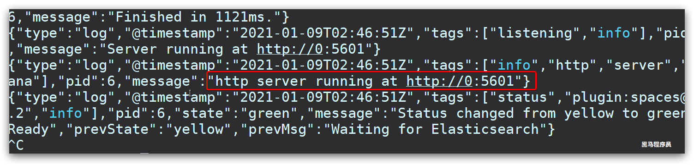

# 安装 elasticsearch

# 1.部署单点 es

## 1.1.创建网络

因为我们还需要部署 kibana 容器，因此需要让 es 和 kibana 容器互联。这里先创建一个网络：

```sh
docker network create es-net
```

## 1.2.加载镜像

这里我们采用 elasticsearch 的 7.12.1 版本的镜像，这个镜像体积非常大，接近 1G。不建议大家自己 pull。

课前资料提供了镜像的 tar 包：


大家将其上传到虚拟机中，然后运行命令加载即可：

```sh
# 导入数据
docker load -i es.tar
```

同理还有`kibana`的 tar 包也需要这样做。

## 1.3.运行

运行 docker 命令，部署单点 es：

```sh
docker run -d \
    --name elasticsearch \
    -e "ES_JAVA_OPTS=-Xms512m -Xmx512m" \
    -e "discovery.type=single-node" \
    -v /home/docker/elasticsearch/es-data:/usr/share/elasticsearch/data \
    -v /home/docker/elasticsearch/es-plugins:/usr/share/elasticsearch/plugins \
    --privileged \
    --network es-net \
    -p 9200:9200 \
    -p 9300:9300 \
elasticsearch
```

命令解释：

- `-e "cluster.name=es-docker-cluster"`：设置集群名称
- `-e "http.host=0.0.0.0"`：监听的地址，可以外网访问
- `-e "ES_JAVA_OPTS=-Xms512m -Xmx512m"`：内存大小
- `-e "discovery.type=single-node"`：非集群模式
- `-v es-data:/usr/share/elasticsearch/data`：挂载逻辑卷，绑定 es 的数据目录
- `-v es-logs:/usr/share/elasticsearch/logs`：挂载逻辑卷，绑定 es 的日志目录
- `-v es-plugins:/usr/share/elasticsearch/plugins`：挂载逻辑卷，绑定 es 的插件目录
- `--privileged`：授予逻辑卷访问权
- `--network es-net` ：加入一个名为 es-net 的网络中
- `-p 9200:9200`：端口映射配置

在浏览器中输入：http://192.168.150.101:9200 即可看到 elasticsearch 的响应结果：


# 2.部署 kibana

kibana 可以给我们提供一个 elasticsearch 的可视化界面，便于我们学习。

## 2.1.部署

运行 docker 命令，部署 kibana

```sh
docker run -d \
--name kibana \
-e ELASTICSEARCH_HOSTS=http://elasticsearch:9200 \
--network=es-net \
-p 5601:5601  \
kibana
```

- `--network es-net` ：加入一个名为 es-net 的网络中，与 elasticsearch 在同一个网络中
- `-e ELASTICSEARCH_HOSTS=http://elasticsearch:9200"`：设置 elasticsearch 的地址，因为 kibana 已经与 elasticsearch 在一个网络，因此可以用容器名直接访问 elasticsearch
- `-p 5601:5601`：端口映射配置

kibana 启动一般比较慢，需要多等待一会，可以通过命令：

```sh
docker logs -f kibana
```

查看运行日志，当查看到下面的日志，说明成功：



此时，在浏览器输入地址访问：http://192.168.150.101:5601，即可看到结果

## 2.2.DevTools

kibana 中提供了一个 DevTools 界面：


这个界面中可以编写 DSL 来操作 elasticsearch。并且对 DSL 语句有自动补全功能。

# 3.安装 IK 分词器

## 3.1.在线安装 ik 插件（较慢）

```shell
# 进入容器内部
docker exec -it elasticsearch /bin/bash

# 在线下载并安装
./bin/elasticsearch-plugin  install https://github.com/medcl/elasticsearch-analysis-ik/releases/download/v7.12.1/elasticsearch-analysis-ik-7.12.1.zip

#退出
exit
#重启容器
docker restart elasticsearch
```

## 3.2.离线安装 ik 插件（推荐）

### 1）查看数据卷目录

安装插件需要知道 elasticsearch 的 plugins 目录位置，而我们用了数据卷挂载，因此需要查看 elasticsearch 的数据卷目录，通过下面命令查看:

```sh
docker volume inspect es-plugins
```

显示结果：

```json
[
  {
    "CreatedAt": "2022-05-06T10:06:34+08:00",
    "Driver": "local",
    "Labels": null,
    "Mountpoint": "/var/lib/docker/volumes/es-plugins/_data",
    "Name": "es-plugins",
    "Options": null,
    "Scope": "local"
  }
]
```

说明 plugins 目录被挂载到了：`/var/lib/docker/volumes/es-plugins/_data `这个目录中。

### 2）解压缩分词器安装包

下面我们需要把课前资料中的 ik 分词器解压缩，重命名为 ik


### 3）上传到 es 容器的插件数据卷中

也就是`/var/lib/docker/volumes/es-plugins/_data `：


### 4）重启容器

```shell
# 4、重启容器
docker restart es
```

```sh
# 查看es日志
docker logs -f es
```

### 5）测试：

IK 分词器包含两种模式：

- `ik_smart`：最少切分

- `ik_max_word`：最细切分

```json
GET /_analyze
{
  "analyzer": "ik_max_word",
  "text": "黑马程序员学习java太棒了"
}
```

结果：

```json
{
  "tokens": [
    {
      "token": "黑马",
      "start_offset": 0,
      "end_offset": 2,
      "type": "CN_WORD",
      "position": 0
    },
    {
      "token": "程序员",
      "start_offset": 2,
      "end_offset": 5,
      "type": "CN_WORD",
      "position": 1
    },
    {
      "token": "程序",
      "start_offset": 2,
      "end_offset": 4,
      "type": "CN_WORD",
      "position": 2
    },
    {
      "token": "员",
      "start_offset": 4,
      "end_offset": 5,
      "type": "CN_CHAR",
      "position": 3
    },
    {
      "token": "学习",
      "start_offset": 5,
      "end_offset": 7,
      "type": "CN_WORD",
      "position": 4
    },
    {
      "token": "java",
      "start_offset": 7,
      "end_offset": 11,
      "type": "ENGLISH",
      "position": 5
    },
    {
      "token": "太棒了",
      "start_offset": 11,
      "end_offset": 14,
      "type": "CN_WORD",
      "position": 6
    },
    {
      "token": "太棒",
      "start_offset": 11,
      "end_offset": 13,
      "type": "CN_WORD",
      "position": 7
    },
    {
      "token": "了",
      "start_offset": 13,
      "end_offset": 14,
      "type": "CN_CHAR",
      "position": 8
    }
  ]
}
```

## 3.3 扩展词词典

随着互联网的发展，“造词运动”也越发的频繁。出现了很多新的词语，在原有的词汇列表中并不存在。比如：“奥力给”，“传智播客” 等。

所以我们的词汇也需要不断的更新，IK 分词器提供了扩展词汇的功能。

1）打开 IK 分词器 config 目录：


2）在 IKAnalyzer.cfg.xml 配置文件内容添加：

```xml
<?xml version="1.0" encoding="UTF-8"?>
<!DOCTYPE properties SYSTEM "http://java.sun.com/dtd/properties.dtd">
<properties>
        <comment>IK Analyzer 扩展配置</comment>
        <!--用户可以在这里配置自己的扩展字典 *** 添加扩展词典-->
        <entry key="ext_dict">ext.dic</entry>
</properties>
```

3）新建一个 ext.dic，可以参考 config 目录下复制一个配置文件进行修改

```
传智播客
奥力给
```

4）重启 elasticsearch

```sh
docker restart es

# 查看 日志
docker logs -f elasticsearch
```


日志中已经成功加载 ext.dic 配置文件

5）测试效果：

```json
GET /_analyze
{
  "analyzer": "ik_max_word",
  "text": "传智播客Java就业超过90%,奥力给！"
}
```

> 注意当前文件的编码必须是 UTF-8 格式，严禁使用 Windows 记事本编辑

## 3.4 停用词词典

在互联网项目中，在网络间传输的速度很快，所以很多语言是不允许在网络上传递的，如：关于宗教、政治等敏感词语，那么我们在搜索时也应该忽略当前词汇。

IK 分词器也提供了强大的停用词功能，让我们在索引时就直接忽略当前的停用词汇表中的内容。

1）IKAnalyzer.cfg.xml 配置文件内容添加：

```xml
<?xml version="1.0" encoding="UTF-8"?>
<!DOCTYPE properties SYSTEM "http://java.sun.com/dtd/properties.dtd">
<properties>
        <comment>IK Analyzer 扩展配置</comment>
        <!--用户可以在这里配置自己的扩展字典-->
        <entry key="ext_dict">ext.dic</entry>
         <!--用户可以在这里配置自己的扩展停止词字典  *** 添加停用词词典-->
        <entry key="ext_stopwords">stopword.dic</entry>
</properties>
```

3）在 stopword.dic 添加停用词

```
习大大
```

4）重启 elasticsearch

```sh
# 重启服务
docker restart elasticsearch
docker restart kibana

# 查看 日志
docker logs -f elasticsearch
```

日志中已经成功加载 stopword.dic 配置文件

5）测试效果：

```json
GET /_analyze
{
  "analyzer": "ik_max_word",
  "text": "传智播客Java就业率超过95%,习大大都点赞,奥力给！"
}
```

> 注意当前文件的编码必须是 UTF-8 格式，严禁使用 Windows 记事本编辑

# 4.部署 es 集群

我们会在单机上利用 docker 容器运行多个 es 实例来模拟 es 集群。不过生产环境推荐大家每一台服务节点仅部署一个 es 的实例。

部署 es 集群可以直接使用 docker-compose 来完成，但这要求你的 Linux 虚拟机至少有**4G**的内存空间

## 4.1.创建 es 集群

首先编写一个 docker-compose 文件，内容如下：

```sh
version: '2.2'
services:
  es01:
    image: elasticsearch:7.12.1
    container_name: es01
    environment:
      - node.name=es01
      - cluster.name=es-docker-cluster
      - discovery.seed_hosts=es02,es03
      - cluster.initial_master_nodes=es01,es02,es03
      - "ES_JAVA_OPTS=-Xms512m -Xmx512m"
    volumes:
      - data01:/usr/share/elasticsearch/data
    ports:
      - 9200:9200
    networks:
      - elastic
  es02:
    image: elasticsearch:7.12.1
    container_name: es02
    environment:
      - node.name=es02
      - cluster.name=es-docker-cluster
      - discovery.seed_hosts=es01,es03
      - cluster.initial_master_nodes=es01,es02,es03
      - "ES_JAVA_OPTS=-Xms512m -Xmx512m"
    volumes:
      - data02:/usr/share/elasticsearch/data
    ports:
      - 9201:9200
    networks:
      - elastic
  es03:
    image: elasticsearch:7.12.1
    container_name: es03
    environment:
      - node.name=es03
      - cluster.name=es-docker-cluster
      - discovery.seed_hosts=es01,es02
      - cluster.initial_master_nodes=es01,es02,es03
      - "ES_JAVA_OPTS=-Xms512m -Xmx512m"
    volumes:
      - data03:/usr/share/elasticsearch/data
    networks:
      - elastic
    ports:
      - 9202:9200
volumes:
  data01:
    driver: local
  data02:
    driver: local
  data03:
    driver: local

networks:
  elastic:
    driver: bridge
```

es 运行需要修改一些 linux 系统权限，修改`/etc/sysctl.conf`文件

```sh
vi /etc/sysctl.conf
```

添加下面的内容：

```sh
vm.max_map_count=262144
```

然后执行命令，让配置生效：

```sh
sysctl -p
```

通过 docker-compose 启动集群：

```sh
docker-compose up -d
```

## 4.2.集群状态监控

kibana 可以监控 es 集群，不过新版本需要依赖 es 的 x-pack 功能，配置比较复杂。

这里推荐使用 cerebro 来监控 es 集群状态，官方网址：https://github.com/lmenezes/cerebro

课前资料已经提供了安装包：


解压即可使用，非常方便。

解压好的目录如下：


进入对应的 bin 目录：


双击其中的 cerebro.bat 文件即可启动服务。


访问 http://localhost:9000 即可进入管理界面：


输入你的 elasticsearch 的任意节点的地址和端口，点击 connect 即可：


绿色的条，代表集群处于绿色（健康状态）。

## 4.3.创建索引库

### 1）利用 kibana 的 DevTools 创建索引库

在 DevTools 中输入指令：

```json
PUT /itcast
{
  "settings": {
    "number_of_shards": 3, // 分片数量
    "number_of_replicas": 1 // 副本数量
  },
  "mappings": {
    "properties": {
      // mapping映射定义 ...
    }
  }
}
```

### 2）利用 cerebro 创建索引库

利用 cerebro 还可以创建索引库：


填写索引库信息：


点击右下角的 create 按钮：


## 4.4.查看分片效果

回到首页，即可查看索引库分片效果：


