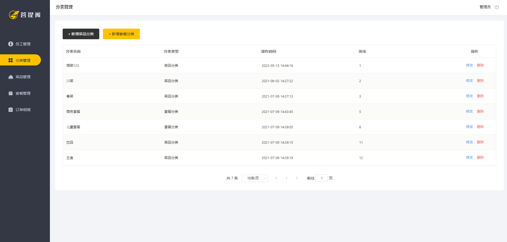
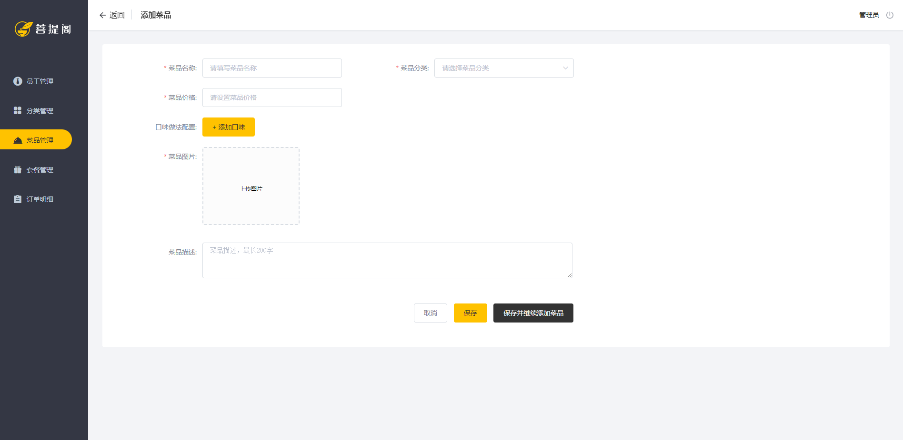

# 菜品管理功能开发

功能概览

{data-zoomable}

{data-zoomable}

1. 创建菜品实体类 Dish

```java
package com.yang.reggie.entity;

import com.baomidou.mybatisplus.annotation.FieldFill;
import com.baomidou.mybatisplus.annotation.IdType;
import com.baomidou.mybatisplus.annotation.TableField;
import com.baomidou.mybatisplus.annotation.TableId;
import lombok.Data;
import java.io.Serializable;
import java.math.BigDecimal;
import java.time.LocalDateTime;

/**
 菜品
 */
@Data
public class Dish implements Serializable {

    private static final long serialVersionUID = 1L;

    private Long id;


    //菜品名称
    private String name;


    //菜品分类id
    private Long categoryId;


    //菜品价格
    private BigDecimal price;


    //商品码
    private String code;


    //图片
    private String image;


    //描述信息
    private String description;


    //0 停售 1 起售
    private Integer status;


    //顺序
    private Integer sort;


    @TableField(fill = FieldFill.INSERT)
    private LocalDateTime createTime;


    @TableField(fill = FieldFill.INSERT_UPDATE)
    private LocalDateTime updateTime;


    @TableField(fill = FieldFill.INSERT)
    private Long createUser;


    @TableField(fill = FieldFill.INSERT_UPDATE)
    private Long updateUser;


    //是否删除
    private Integer isDeleted;

}
```

仅有实体类的字段不足以实现页面功能，需要新增 **分类** 和 **口味** 字段，所以扩展对象 DishDto

数据传输对象（DTO）(Data Transfer Object)

```java
package com.yang.reggie.dto;

import com.yang.reggie.entity.Dish;
import com.yang.reggie.entity.DishFlavor;
import lombok.Data;

import java.util.ArrayList;
import java.util.List;

@Data
public class DishDto extends Dish {

  private List<DishFlavor> flavors = new ArrayList<>();

  private String categoryName;

  private Integer copies;
}

```

2. 创建 Mapper

```java
package com.yang.reggie.mapper;

import com.baomidou.mybatisplus.core.mapper.BaseMapper;
import com.yang.reggie.entity.Dish;
import org.apache.ibatis.annotations.Mapper;

@Mapper
public interface DishMapper extends BaseMapper<Dish> {
}
```

```java
package com.yang.reggie.mapper;

import com.baomidou.mybatisplus.core.mapper.BaseMapper;
import com.yang.reggie.entity.DishFlavor;
import org.apache.ibatis.annotations.Mapper;

@Mapper
public interface DishFlavorMapper extends BaseMapper<DishFlavor> {
}

```

3. 创建 Service

```java
package com.yang.reggie.service;

import com.baomidou.mybatisplus.extension.service.IService;
import com.yang.reggie.dto.DishDto;
import com.yang.reggie.entity.Dish;

public interface DishService extends IService<Dish> {
  //新增菜品，同时插入菜品对应的口味数据，需要操作两张表：dish、dish_flavor
  public void saveWithFlavor(DishDto dishDto);

  //根据id查询菜品信息和对应的口味信息
  public DishDto getByIdWithFlavor(Long id);

  //更新菜品信息，同时更新对应的口味信息
  public void updateWithFlavor(DishDto dishDto);
}
```

```java
package com.yang.reggie.service;

import com.baomidou.mybatisplus.extension.service.IService;
import com.yang.reggie.entity.DishFlavor;
import com.yang.reggie.mapper.DishFlavorMapper;

public interface DishFlavorService extends IService<DishFlavor> {
}

```

4. ServiceImpl

```java
package com.yang.reggie.service.impl;

import com.baomidou.mybatisplus.core.conditions.query.LambdaQueryWrapper;
import com.baomidou.mybatisplus.extension.service.impl.ServiceImpl;
import com.yang.reggie.dto.DishDto;
import com.yang.reggie.entity.Dish;
import com.yang.reggie.entity.DishFlavor;
import com.yang.reggie.mapper.DishMapper;
import com.yang.reggie.service.DishFlavorService;
import com.yang.reggie.service.DishService;
import lombok.extern.slf4j.Slf4j;
import org.springframework.beans.BeanUtils;
import org.springframework.beans.factory.annotation.Autowired;
import org.springframework.stereotype.Service;
import org.springframework.transaction.annotation.Transactional;

import java.util.List;
import java.util.stream.Collectors;

@Service
@Slf4j
public class DishServiceImpl extends ServiceImpl<DishMapper, Dish> implements DishService {

  @Autowired
  private DishFlavorService dishFlavorService;

  /**
   * 新增菜品，同时保存对应的口味数据
   *
   * @param dishDto
   */
  @Transactional
  public void saveWithFlavor(DishDto dishDto) {
    // 保存菜品的基本信息到菜品表dish
    this.save(dishDto);

    Long dishId = dishDto.getId();// 菜品id

    // 菜品口味
    List<DishFlavor> flavors = dishDto.getFlavors();
    flavors = flavors.stream().map((item) -> {
      item.setDishId(dishId);
      return item;
    }).collect(Collectors.toList());

    // 保存菜品口味数据到菜品口味表dish_flavor
    dishFlavorService.saveBatch(flavors);

  }

  /**
   * 根据id查询菜品信息和对应的口味信息
   *
   * @param id
   * @return
   */
  public DishDto getByIdWithFlavor(Long id) {
    // 查询菜品基本信息，从dish表查询
    Dish dish = this.getById(id);

    DishDto dishDto = new DishDto();
    BeanUtils.copyProperties(dish, dishDto);

    // 查询当前菜品对应的口味信息，从dish_flavor表查询
    LambdaQueryWrapper<DishFlavor> queryWrapper = new LambdaQueryWrapper<>();
    queryWrapper.eq(DishFlavor::getDishId, dish.getId());
    List<DishFlavor> flavors = dishFlavorService.list(queryWrapper);
    dishDto.setFlavors(flavors);

    return dishDto;
  }

  @Override
  @Transactional
  public void updateWithFlavor(DishDto dishDto) {
    // 更新dish表基本信息
    this.updateById(dishDto);

    // 清理当前菜品对应口味数据---dish_flavor表的delete操作
    LambdaQueryWrapper<DishFlavor> queryWrapper = new LambdaQueryWrapper();
    queryWrapper.eq(DishFlavor::getDishId, dishDto.getId());

    dishFlavorService.remove(queryWrapper);

    // 添加当前提交过来的口味数据---dish_flavor表的insert操作
    List<DishFlavor> flavors = dishDto.getFlavors();

    flavors = flavors.stream().map((item) -> {
      item.setDishId(dishDto.getId());
      return item;
    }).collect(Collectors.toList());

    dishFlavorService.saveBatch(flavors);
  }
}
```

```java
package com.yang.reggie.service.impl;

import com.baomidou.mybatisplus.extension.service.impl.ServiceImpl;
import com.yang.reggie.entity.DishFlavor;
import com.yang.reggie.mapper.DishFlavorMapper;
import com.yang.reggie.service.DishFlavorService;
import org.springframework.stereotype.Service;

@Service
public class DishFlavorServiceImpl extends ServiceImpl<DishFlavorMapper, DishFlavor> implements DishFlavorService {
}

```

5. 控制器

```java
/**
 * 菜品管理
 */
@RestController
@RequestMapping("/dish")
@Slf4j
public class DishController {
  @Autowired
  private DishService dishService;

  @Autowired
  private DishFlavorService dishFlavorService;

  @Autowired
  private CategoryService categoryService;

  /**
   * 新增菜品
   *
   * @param dishDto
   * @return
   */
  @PostMapping
  public R<String> save(@RequestBody DishDto dishDto) {
    log.info(dishDto.toString());

    dishService.saveWithFlavor(dishDto);

    return R.success("新增菜品成功");
  }
}
```
