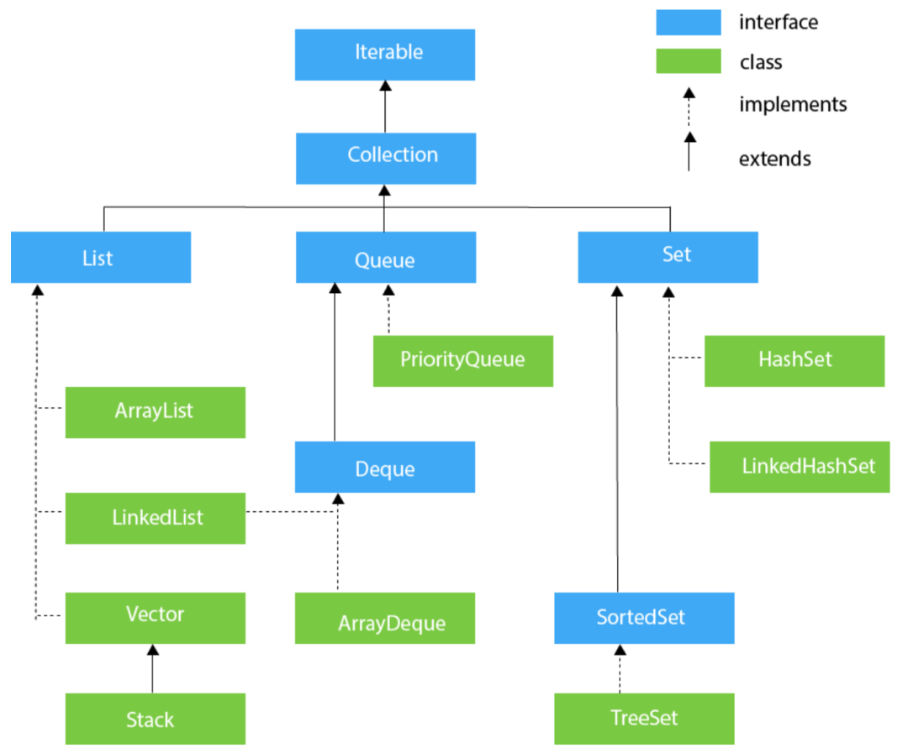
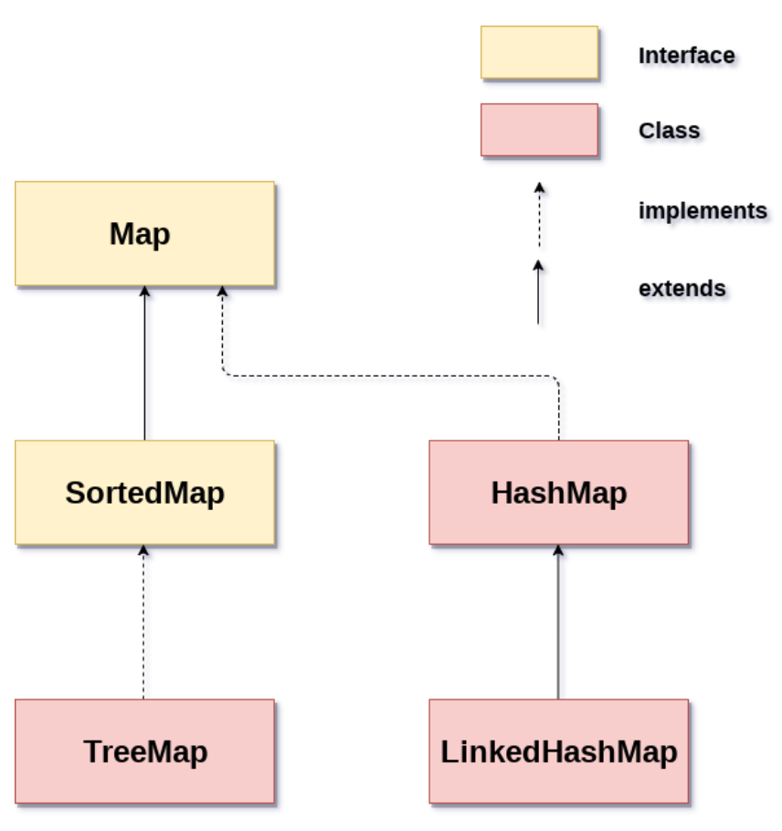

# 集合类

## 集合

Java 中常见的集合类：

1. List：有序的元素集合，允许重复元素，可以根据索引位置访问元素。常用的实现类包括 ArrayList、LinkedList 和 Vector。

2. Set：无序的元素集合，不允许重复元素。常用的实现类包括 HashSet、TreeSet 和 LinkedHashSet。

3. Map：存储键值对的集合，键不能重复，值可以重复。常用的实现类包括 HashMap、TreeMap 和 LinkedHashMap。

**Collection 接口是 Java 集合框架的根接口**

- **add(E e)**：将元素 e 添加到集合中。
- **remove(Object o)**：从集合中删除元素 o。
- **size()**：返回集合中元素的数量。
- **isEmpty()**：判断集合是否为空。
- **contains(Object o)**：判断集合是否包含元素 o。
- **iterator()**：返回一个用于迭代集合中元素的迭代器。
- **toArray()**：将集合中的元素转换为数组。
- **clear()**：清空集合中的所有元素。
- ...

---

`Collection` 接口的继承体系图:



**HashSet**

```java
import java.util.HashSet;
import java.util.Set;

public class SetExample {
    public static void main(String[] args) {
        // 创建一个HashSet对象
        Set<String> set = new HashSet<>();

        // 添加元素
        set.add("apple");
        set.add("banana");
        set.add("orange");
        set.add("pear");

        // 遍历Set中的元素
        for (String s : set) {
            System.out.println(s);
        }

        // 判断Set中是否包含某个元素
        if (set.contains("apple")) {
            System.out.println("Set contains apple.");
        }

        // 删除Set中的元素
        set.remove("pear");

        // 输出Set中剩余的元素
        System.out.println("After remove:");
        for (String s : set) {
            System.out.println(s);
        }

        // 获取Set中元素的个数
        System.out.println("Set size: " + set.size());
    }
}

```

**SortedSet**

SortedSet 是 Java 集合框架中的一个接口，它继承自 Set 接口，表示一组有序的不重复元素。SortedSet 中的元素必须是可比较的，并且根据元素的比较结果进行排序。

SortedSet 接口的实现类有许多种，常见的有 TreeSet。TreeSet 基于红黑树实现，可以对元素进行自然排序或指定比较器进行排序。

```java
import java.util.SortedSet;
import java.util.TreeSet;

public class SortedSetExample {
    public static void main(String[] args) {
        // 创建一个TreeSet对象
        SortedSet<Integer> set = new TreeSet<>();

        // 添加元素
        set.add(5);
        set.add(2);
        set.add(8);
        set.add(1);
        set.add(6);

        // 输出Set中的元素
        for (Integer i : set) {
            System.out.println(i);
        }
        // 1 2 5 6 8

        // 获取Set中第一个元素和最后一个元素
        System.out.println("First element: " + set.first());
        // First element: 1
        System.out.println("Last element: " + set.last());
        // Last element: 8

        // 获取小于5的元素
        SortedSet<Integer> subset = set.headSet(5);
        System.out.println("Elements less than 5: " + subset);
        // Elements less than 5: [1, 2]

        // 获取大于等于5的元素
        SortedSet<Integer> tailset = set.tailSet(5);
        System.out.println("Elements greater than or equal to 5: " + tailset);
        // Elements greater than or equal to 5: [5, 6, 8]
    }
}

```

---

## 映射

Map 是 Java 集合框架中的一个接口，它表示一组键值对，其中键和值都是 Java 对象。Map 中的键是唯一的，每个键只能对应一个值。Map 接口的实现类有许多种，常见的有 HashMap、TreeMap 和 LinkedHashMap。

`Map` 接口的继承体系图：


```java
import java.util.HashMap;
import java.util.Map;

public class MapExample {
    public static void main(String[] args) {
        // 创建一个HashMap对象
        Map<String, Integer> map = new HashMap<>();

        // 添加键值对
        map.put("apple", 100);
        map.put("banana", 200);
        map.put("orange", 300);

        // 输出Map中的所有键值对
        for (Map.Entry<String, Integer> entry : map.entrySet()) {
            System.out.println(entry.getKey() + " : " + entry.getValue());
        }
        // banana : 200
        // orange : 300
        // apple : 100

        // 判断Map中是否包含某个键
        if (map.containsKey("apple")) {
            System.out.println("Map contains key apple.");
        }

        // 删除Map中的某个键值对
        map.remove("orange");

        // 输出Map中剩余的键值对
        System.out.println("After remove:");
        for (Map.Entry<String, Integer> entry : map.entrySet()) {
            System.out.println(entry.getKey() + " : " + entry.getValue());
        }

        // banana : 200
        // apple : 100

        // 获取Map中元素的个数
        System.out.println("Map size: " + map.size());
        // Map size: 2
    }
}
```

## 不可变集合

Java 中的不可变集合表示一旦创建就不能被修改，所有的修改操作都会导致返回新的集合对象。Java 中可以使用以下几种方式来创建不可变集合：

1. 使用 `Collections.unmodifiableXXX()` 方法：Java 提供了一组工具方法来将现有的可变集合转换为不可变集合，例如 `unmodifiableList()`、`unmodifiableSet()`和 `unmodifiableMap()` 等。这些方法返回的集合是只读的，任何修改操作都会导致 `UnsupportedOperationException` 异常。

```java
List<String> mutableList = new ArrayList<>(Arrays.asList("a", "b", "c"));
List<String> immutableList = Collections.unmodifiableList(mutableList);
```

2. 使用 Guava 组件库：Google Guava 提供了 `ImmutableXXX` 类和相应的 `builder` 模式来创建不可变集合。例如，`ImmutableList`、`ImmutableSet` 和 `ImmutableMap` 等。

```java
List<String> immutableList = ImmutableList.of("a", "b", "c");
Set<Integer> immutableSet = ImmutableSet.of(1, 2, 3);
Map<String, Integer> immutableMap = ImmutableMap.of("a", 1, "b", 2, "c", 3);

```

## Stream 流

在 Java 8 中，得益于 Lambda 所带来的函数式编程， 引入了一个全新的 Stream 流概念。目的：**用于简化集合和数组操作的 API**。

**Stream 流有以下几个特点：**

1. Stream 不存储数据：stream 并不会在内存中保存数据，它们是依次处理每个数据项生成的，所以一个 stream 的大小并不受限制，而且数据源中的数据也可以是无限的。

2. Stream 操作是惰性的：stream 中的操作都是惰性执行的，这意味着它们不会立即处理所有的元素，而是在需要时才逐个进行处理。

3. Stream 可以操作任何类型的数据：虽然我们通常使用 Stream 处理集合类数据，但 Stream API 可以用来处理任何类型的数据，甚至是 I/O 操作和网络操作返回的数据流。

Stream 流的常用方法：

| 方法    | 描述                                                                 |
| ------- | -------------------------------------------------------------------- |
| filter  | 使用给定的谓词测试对象，并将符合条件的对象放入一个新的 Stream 中。   |
| map     | 对 Stream 中的每个元素应用一个函数，并将结果放入一个新的 Stream 中。 |
| reduce  | 将 Stream 中的元素组合起来，产生一个新的值。                         |
| collect | 将 Stream 中的元素转换成集合或者其他数据结构。                       |
| forEach | 对 Stream 中的每个元素执行给定的操作。                               |
| sorted  | 对 Stream 中的元素进行排序。                                         |

```java
// 创建一个字符串列表
List<String> strings = Arrays.asList("abc", "", "bc", "efg", "abcd", "", "jkl");

// 使用 filter() 方法过滤空字符串并使用 map() 方法将剩余的字符串转换成大写形式
List<String> filteredAndMapped = strings.stream().filter(s -> !s.isEmpty()).map(String::toUpperCase).collect(Collectors.toList());

// 输出结果
System.out.println(filteredAndMapped);

```
