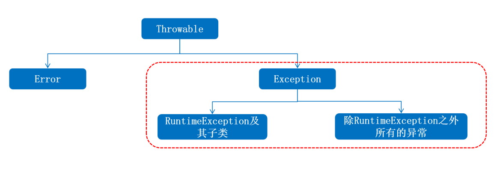

# 异常

异常是程序在“编译”或者“执行”的过程中可能出现的问题，注意：**语法错误不算在异常体系中**

比如:数组索引越界、空指针异常、 日期格式化异常，等…

- 异常一旦出现了，如果没有提前处理，程序就会退出 JVM 虚拟机而终止.
- 研究异常并且避免异常，然后提前处理异常，体现的是程序的安全, 健壮性。

**异常体系：**

{data-zoomable}

**分类：**

**编译时异常**：没有继承 RuntimeExcpetion 的异常，编译阶段就会出错。
**运行时异常**：继承自 RuntimeException 的异常或其子类，编译阶段不报错，运行可能报错

运行时异常示例：(编程逻辑不严谨引起的程序错误)

- 数组索引越界异常: `ArrayIndexOutOfBoundsException`
- 空指针异常: `NullPointerException`，直接输出没有问题，但是调用空指针的变量的功能就会报错。
- 数学操作异常：`ArithmeticException`
- 类型转换异常：`ClassCastException`
- 数字转换异常: `NumberFormatException`

编译时异常示例：

```java
try {
    File file = new File("myfile.txt");
    FileReader fr = new FileReader(file);
} catch (FileNotFoundException e) {
    System.out.println("文件不存在！");
}
```

```java
try {
    SimpleDateFormat sdf = new SimpleDateFormat("yyyy-MM-dd");
    Date date = sdf.parse("2022-01-01");
} catch (ParseException e) {
    System.out.println("日期解析错误！");
}
```

```java
try {
    Connection conn = DriverManager.getConnection("jdbc:mysql://localhost:3306/mydatabase", "username", "password");
    Statement stmt = conn.createStatement();
    ResultSet rs = stmt.executeQuery("SELECT * FROM mytable");
} catch (SQLException e) {
    System.out.println("SQL 查询错误！");
}
```

**异常默认处理流程：**

默认的异常处理机制并不好，一旦真的出现异常，程序立即死亡！

1. 默认会在出现异常的代码那里自动的创建一个异常对象：`ArithmeticException`。
2. 异常会从方法中出现的点这里抛出给调用者，调用者最终抛出给 JVM 虚拟机。
3. 虚拟机接收到异常对象后，先在控制台直接输出异常栈信息数据。
4. 直接从当前执行的异常点干掉当前程序。
5. 后续代码没有机会执行了，因为程序已经死亡。

## 编译时异常处理机制

- try...catch...
- throws Exception

```java
try{
    // 监视可能出现异常的代码！
}catch(Exception e){
    e.printStackTrace(); // 直接打印异常栈信息
}
// Exception可以捕获处理一切异常类型！
```

在开发中，一般**底层的异常抛出去给最外层，最外层集中捕获处理**。

## 运行时异常处理机制

建议在最外层调用处集中捕获处理即可

## 自定义异常

**自定义编译时异常**

- 定义一个异常类继承 Exception.
- 重写构造器
- 在出现异常的地方用 throw new 自定义对象抛出

```java
// 创建一个名为 AgeLimitException 的异常类来表示年龄限制错误。
public class AgeLimitException extends Exception {
    public AgeLimitException(String message) {
        super(message);
    }
}
```

```java
public void validateAge(int age) throws AgeLimitException {
    if (age > 120) {
        throw new AgeLimitException("年龄不能大于 120");
    } else {
        System.out.println("年龄验证通过！");
    }
}

try {
    validateAge(130);
} catch (AgeLimitException e) {
    System.out.println(e.getMessage());
}

```

**自定义运行时异常**

- 定义一个异常类继承 RuntimeException
- 重写构造器
- 在出现异常的地方用 throw new 自定义对象抛出!

```java
public class MyRuntimeException extends RuntimeException {
    public MyRuntimeException(String message) {
        super(message);
    }
}

throw new MyRuntimeException("发生了自定义异常");

try {
    // some code that may throw MyRuntimeException
} catch (MyRuntimeException e) {
    System.out.println("捕获到自定义异常：" + e.getMessage());
}

```
