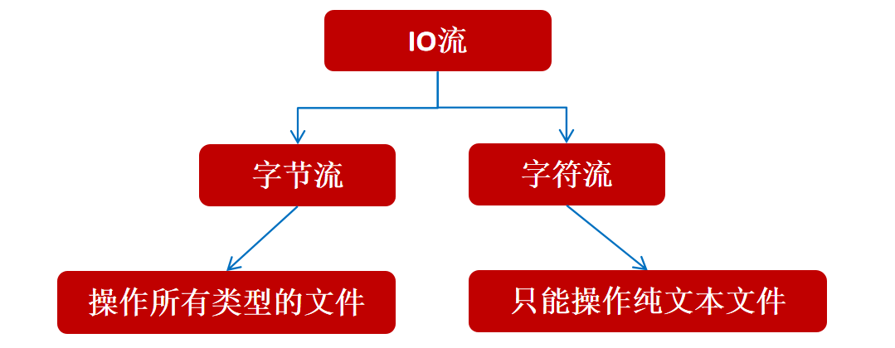
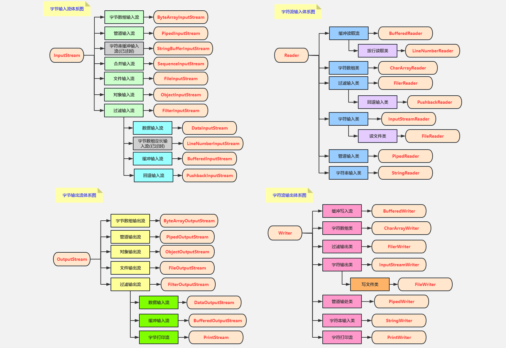

# IO 流

IO 即 Input/Output，输入和输出。数据输入到计算机内存的过程即输入，反之输出到外部存储（比如数据库，文件，远程主机）的过程即输出。数据传输过程类似于水流，因此称为 IO 流。IO 流在 Java 中分为输入流和输出流，而根据数据的处理方式又分为字节流和字符流。

{data-zoomable}

## 字节流

### 字节输入流 (InputStream)

**作用：以内存为基准，把磁盘文件中的数据以字节的形式读取到内存中去**

`InputStream` 常用方法 ：

- `read()` ：返回输入流中下一个字节的数据。返回的值介于 0 到 255 之间。如果未读取任何字节，则代码返回 `-1` ，表示文件结束。
- `read(byte b[ ])` : 从输入流中读取一些字节存储到数组 `b` 中。如果数组 `b` 的长度为零，则不读取。如果没有可用字节读取，返回 `-1`。如果有可用字节读取，则最多读取的字节数最多等于 `b.length` ， 返回读取的字节数。这个方法等价于 `read(b, 0, b.length)`。
- `read(byte b[], int off, int len)` ：在`read(byte b[ ])` 方法的基础上增加了 `off` 参数（偏移量）和 `len` 参数（要读取的最大字节数）。
- `skip(long n)` ：忽略输入流中的 n 个字节 ,返回实际忽略的字节数。
- `available()` ：返回输入流中可以读取的字节数。
- `close()` ：关闭输入流释放相关的系统资源。

从 Java 9 开始，`InputStream` 新增加了多个实用的方法：

- `readAllBytes()` ：读取输入流中的所有字节，返回字节数组。
- `readNBytes(byte[] b, int off, int len)` ：阻塞直到读取 `len` 个字节。
- `transferTo(OutputStream out)` ： 将所有字节从一个输入流传递到一个输出流。


```java
try (InputStream fis = new FileInputStream("input.txt")) {
    System.out.println("Number of remaining bytes:"
            + fis.available());
    int content;
    long skip = fis.skip(2);
    System.out.println("The actual number of bytes skipped:" + skip);
    System.out.print("The content read from file:");
    while ((content = fis.read()) != -1) {
        System.out.print((char) content);
    }
} catch (IOException e) {
    e.printStackTrace();
}
```


### 字节输出流(OutputStream)

**作用：以内存为基准，把内存中的数据以字节的形式写出到磁盘文件中去的流。**

`OutputStream` 常用方法 ：

- `write(int b)` ：将特定字节写入输出流。
- `write(byte b[ ])` : 将数组`b` 写入到输出流，等价于 `write(b, 0, b.length)` 。
- `write(byte[] b, int off, int len)` : 在`write(byte b[ ])` 方法的基础上增加了 `off` 参数（偏移量）和 `len` 参数（要读取的最大字节数）。
- `flush()` ：刷新此输出流并强制写出所有缓冲的输出字节。
- `close()` ：关闭输出流释放相关的系统资源。

`FileOutputStream` 是最常用的字节输出流对象，可直接指定文件路径，可以直接输出单字节数据，也可以输出指定的字节数组。

```java
try (FileOutputStream output = new FileOutputStream("output.txt")) {
    byte[] array = "JavaGuide".getBytes();
    output.write(array);
} catch (IOException e) {
    e.printStackTrace();
}
```


## 字符流

### 字符输入流(Reader)

以内存为基准，把磁盘文件中的数据以字符的形式读取到内存中去。


不管是文件读写还是网络发送接收，信息的最小存储单元都是字节。 **那为什么 I/O 流操作要分为字节流操作和字符流操作呢？**

个人认为主要有两点原因：

- 字符流是由 Java 虚拟机将字节转换得到的，这个过程还算是比较耗时。
- 如果我们不知道编码类型就很容易出现乱码问题

`Reader` 常用方法 ：

- `read()` : 从输入流读取一个字符。
- `read(char[] cbuf)` : 从输入流中读取一些字符，并将它们存储到字符数组 `cbuf`中，等价于 `read(cbuf, 0, cbuf.length)` 。
- `read(char[] cbuf, int off, int len)` ：在`read(char[] cbuf)` 方法的基础上增加了 `off` 参数（偏移量）和 `len` 参数（要读取的最大字符数）。
- `skip(long n)` ：忽略输入流中的 n 个字符 ,返回实际忽略的字符数。
- `close()` : 关闭输入流并释放相关的系统资源。

```java
try (FileReader fileReader = new FileReader("input.txt");) {
    int content;
    long skip = fileReader.skip(3);
    System.out.println("The actual number of bytes skipped:" + skip);
    System.out.print("The content read from file:");
    while ((content = fileReader.read()) != -1) {
        System.out.print((char) content);
    }
} catch (IOException e) {
    e.printStackTrace();
}
```


### 字符输出流(Writer)

`Writer` 常用方法 ：

- `write(int c)` : 写入单个字符。
- `write(char[] cbuf)` ：写入字符数组 `cbuf`，等价于`write(cbuf, 0, cbuf.length)`。
- `write(char[] cbuf, int off, int len)` ：在`write(char[] cbuf)` 方法的基础上增加了 `off` 参数（偏移量）和 `len` 参数（要读取的最大字符数）。
- `write(String str)` ：写入字符串，等价于 `write(str, 0, str.length())` 。
- `write(String str, int off, int len)` ：在`write(String str)` 方法的基础上增加了 `off` 参数（偏移量）和 `len` 参数（要读取的最大字符数）。
- `append(CharSequence csq)` ：将指定的字符序列附加到指定的 `Writer` 对象并返回该 `Writer` 对象。
- `append(char c)` ：将指定的字符附加到指定的 `Writer` 对象并返回该 `Writer` 对象。
- `flush()` ：刷新此输出流并强制写出所有缓冲的输出字符。
- `close()`:关闭输出流释放相关的系统资源。

```java	
try (Writer output = new FileWriter("output.txt")) {
    output.write("你好，我是Guide。");
} catch (IOException e) {
    e.printStackTrace();
}
```


## IO 流资源释放

```java
try {
    FileOutputStream fos = new FileOutputStream("a.txt");
    fos.write(97); 
} catch (IOException e) {
    e.printStackTrace();
} finally {
    // do sthing...
}

```

如下代码，try catch 写的较多，如果有更多的 io 流资源要释放，会更多复杂代码。

```java
InputStream is = null ;
OutputStream os = null;
try{
    // ....
}catch (Exception e){
    e.printStackTrace();} finally {
    // 关闭资源！
    try {
        if(os != null) os.close();
    } catch (Exception e) {
        e.printStackTrace();
    }
    try {
        if(is != null) is.close();
    } catch (Exception e) {
        e.printStackTrace();
    }
}

```


JDK7 改进

```
try(定义流对象){
	可能出现异常的代码;
}catch(异常类名 变量名){
	异常的处理代码;
} 

```

JDK9 改进

```
定义输入流对象;
定义输出流对象;

try(输入流对象；输出流对象){
	可能出现异常的代码;
}catch(异常类名 变量名){
	异常的处理代码;
} 

```

- JDK 7 以及 JDK 9的()中只能放置资源对象，否则报错
- 什么是资源呢？
- 资源都是实现了Closeable/AutoCloseable接口的类对象

## 缓冲流

IO 操作是很消耗性能的，缓冲流将数据加载至缓冲区，一次性读取/写入多个字节，从而避免频繁的 IO 操作，提高流的传输效率。

字节缓冲流这里采用了装饰器模式来增强 `InputStream` 和`OutputStream`子类对象的功能。


```java
BufferedInputStream bufferedInputStream = new BufferedInputStream(new FileInputStream("input.txt"));
```


### 字节缓冲输入流

`BufferedInputStream` 内部维护了一个缓冲区，这个缓冲区实际就是一个字节数组，通过阅读 `BufferedInputStream` 源码即可得到这个结论。

```java
public
class BufferedInputStream extends FilterInputStream {
    // 内部缓冲区数组
    protected volatile byte buf[];
    // 缓冲区的默认大小
    private static int DEFAULT_BUFFER_SIZE = 8192;
    // 使用默认的缓冲区大小
    public BufferedInputStream(InputStream in) {
        this(in, DEFAULT_BUFFER_SIZE);
    }
    // 自定义缓冲区大小
    public BufferedInputStream(InputStream in, int size) {
        super(in);
        if (size <= 0) {
            throw new IllegalArgumentException("Buffer size <= 0");
        }
        buf = new byte[size];
    }
}
```

缓冲区的大小默认为 **8192** 字节，当然了，你也可以通过 `BufferedInputStream(InputStream in, int size)` 这个构造方法来指定缓冲区的大小。

### BufferedOutputStream（字节缓冲输出流）

`BufferedOutputStream` 将数据（字节信息）写入到目的地（通常是文件）的过程中不会一个字节一个字节的写入，而是会先将要写入的字节存放在缓存区，并从内部缓冲区中单独写入字节。这样大幅减少了 IO 次数，提高了读取效率


```java
try (BufferedOutputStream bos = new BufferedOutputStream(new FileOutputStream("output.txt"))) {
    byte[] array = "JavaGuide".getBytes();
    bos.write(array);
} catch (IOException e) {
    e.printStackTrace();
}
```

类似于 `BufferedInputStream` ，`BufferedOutputStream` 内部也维护了一个缓冲区，并且，这个缓存区的大小也是 **8192** 字节。

### 字符缓冲流

`BufferedReader` （字符缓冲输入流）和 `BufferedWriter`（字符缓冲输出流）类似于 `BufferedInputStream`（字节缓冲输入流）和`BufferedOutputStream`（字节缓冲输入流），内部都维护了一个字节数组作为缓冲区。不过，前者主要是用来操作字符信息。


## 打印流

- PrintStream
- PrintWriter


`System.out` 实际是用于获取一个 `PrintStream` 对象，`print`方法实际调用的是 `PrintStream` 对象的 `write` 方法。

```java
public class PrintStream extends FilterOutputStream
    implements Appendable, Closeable {
}
public class PrintWriter extends Writer {
}
```


{data-zoomable}


## IO 流框架

- common-io 
