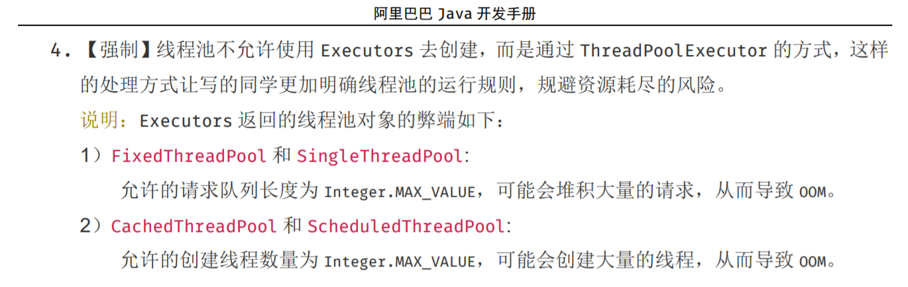
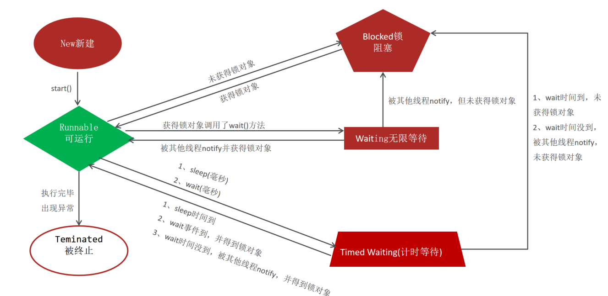

# 多线程

## 多线程的创建

1. 继承 Thread 类
   定义一个类，继承 Thread 类，并重写 run()方法，run()方法中是线程执行的代码。

```java
class MyThread extends Thread {
    public void run() {
        // 线程执行的代码
    }
}

// 创建并启动线程
MyThread thread = new MyThread();
thread.start();

```

2. 实现 Runnable 接口
   定义一个类实现 Runnable 接口，并重写 run()方法，run()方法中是线程执行的代码。然后创建 Thread 对象，并传入实现了 Runnable 接口的对象作为参数，调用 start()方法启动线程。

```java
class MyRunnable implements Runnable {
    public void run() {
        // 线程执行的代码
    }
}

// 创建并启动线程
MyRunnable runnable = new MyRunnable();
Thread thread = new Thread(runnable);
thread.start();

```

3. JDK 5.0 新增：实现 Callable 接口
   Callable 接口是一个泛型接口，它定义了一个名为 call()的方法，它可以在执行完后返回一个结果。和 Runnable 接口不同，它允许抛出异常。

```java
import java.util.concurrent.Callable;
import java.util.concurrent.FutureTask;

class MyCallable implements Callable<Integer> {
    @Override
    public Integer call() throws Exception {
        // 线程执行的代码
        return 1;
    }
}

// 创建并启动线程
MyCallable callable = new MyCallable();
FutureTask<Integer> futureTask = new FutureTask<>(callable);
Thread thread = new Thread(futureTask);
thread.start();

try {
    Integer result = futureTask.get();
    System.out.println("线程执行结果：" + result);
} catch (Exception e) {
    e.printStackTrace();
}

```

优缺点比较

| 方式               | 优点                                                                 | 缺点                                                   |
| ------------------ | -------------------------------------------------------------------- | ------------------------------------------------------ |
| 继承 Thread 类     | 编程比较简单，可以直接使用 Thread 类中的方法                         | 扩展性较差，不能再继承其他的类，不能返回线程执行的结果 |
| 实现 Runnable 接口 | 扩展性强，实现该接口的同时还可以继承其他的类。                       | 编程相对复杂，不能返回线程执行的结果                   |
| 实现 Callable 接口 | 扩展性强，实现该接口的同时还可以继承其他的类。可以得到线程执行的结果 | 编程相对复杂                                           |

## 常用方法

| 方法名          | 说明               | 用途                                 |
| --------------- | ------------------ | ------------------------------------ |
| start()         | 启动线程           | 创建并启动一个新线程                 |
| run()           | 线程执行的代码     | 线程启动后执行的代码                 |
| join()          | 等待线程结束       | 主线程等待子线程执行完毕再继续执行   |
| sleep()         | 线程休眠           | 让线程休眠一定时间                   |
| interrupt()     | 中断线程           | 中断正在执行的线程                   |
| isInterrupted() | 判断线程是否被中断 | 判断线程是否被中断                   |
| yield()         | 让出 CPU           | 让线程释放 CPU，使其他线程有机会执行 |
| setPriority()   | 设置线程优先级     | 设置线程的优先级                     |
| getName()       | 获取线程名称       | 获取线程的名称                       |
| setName()       | 设置线程名称       | 设置线程的名称                       |

**join()**

让一个线程等待另一个线程执行完成后再继续执行。可以使用 join()方法让主线程等待子线程执行完成，或者让一个线程等待其他线程执行完成。

```java
public class ThreadJoinExample extends Thread {
    public void run() {
        System.out.println("子线程开始执行");
        try {
            Thread.sleep(5000);
        } catch (InterruptedException e) {
            e.printStackTrace();
        }
        System.out.println("子线程执行完毕");
    }
    public static void main(String[] args) throws InterruptedException {
        ThreadJoinExample thread = new ThreadJoinExample();
        thread.start();
        System.out.println("主线程开始执行");
        thread.join();
        System.out.println("主线程执行完毕");
    }
}
// 主线程开始执行
// 子线程开始执行

等待5s

// 子线程执行完毕
// 主线程执行完毕

```

## 线程安全

Java 线程安全是指多线程并发访问共享资源时，保证数据在多线程环境下的正确性和一致性。在多线程环境下，由于线程执行的先后顺序和执行时间的不确定性，可能会出现一些问题，如竞态条件（Race Condition）、死锁、内存泄漏等，这些问题都会导致程序出现不可预料的错误。因此，在多线程编程中，保证线程安全是非常重要的。

Java 中提供了一些线程安全的机制，包括同步锁、volatile 变量、原子类, Lock 锁等。

1. **同步锁**

   同步锁是 Java 中最常用的线程安全机制，可以使用 synchronized 关键字来实现。同步锁可以保证同一时间只有一个线程可以访问共享资源，其他线程需要等待。同步锁的实现基于 Java 中的对象锁，当一个线程获取了该对象的锁时，其他线程必须等待锁的释放才能继续执行。

   ```java
   public class SynchronizedExample {
       private int count = 0;

       public synchronized void increment() {
           count++;
       }

       public synchronized void decrement() {
           count--;
       }

       public synchronized int getCount() {
           return count;
       }
   }

   ```

   **同步代码块**

   同步代码块是一种使用 synchronized 关键字对某个代码块进行同步的机制，它可以将对共享资源的访问限制在同一时间内只有一个线程进行。

   一个同步代码块可以通过指定一个锁对象来实现同步。在进入同步代码块之前，线程必须先获得该锁对象的锁，当线程离开同步代码块时，它将释放该锁。

   ```java
   public class SynchronizedBlockExample {
       private int count = 0;
       private final Object lock = new Object();

       public void increment() {
           synchronized(lock) {
               count++;
           }
       }

       public void decrement() {
           synchronized(lock) {
               count--;
           }
       }

       public int getCount() {
           synchronized(lock) {
               return count;
           }
       }
   }

   ```

   锁对象的规范要求？

   1. 锁对象必须是一个引用类型的对象。
   2. 锁对象必须是 final 修饰的，以确保锁对象的引用不会发生变化。
   3. 锁对象必须是所有线程所共享的对象，即不能创建多个锁对象，每个线程使用自己的锁对象，否则就会出现线程间的同步问题。
   4. 锁对象必须是线程安全的，即在多线程环境下不会出现竞态条件的情况，可以使用一些线程安全的对象，如 ConcurrentHashMap、AtomicInteger 等作为锁对象。

2. **变量**

   volatile 关键字可以保证线程之间的可见性，即一个线程修改了一个 volatile 变量的值，其他线程可以立即看到这个变化。这是因为 volatile 变量在修改时会立即同步到主内存中，而其他线程在访问时会先从主内存中读取该变量的最新值。

   ```java
   public class VolatileExample {
       private volatile int count = 0;

       public void increment() {
           count++;
       }

       public void decrement() {
           count--;
       }

       public int getCount() {
           return count;
       }
   }

   ```

3. **原子类**

   原子类是一种线程安全的类，可以在多线程环境下安全地对其进行操作，而不需要使用同步锁等机制。Java 中提供了一些原子类，例如 AtomicInteger、AtomicBoolean 等，可以在多线程环境下安全地对其进行操作。

   ```java
   import java.util.concurrent.atomic.AtomicInteger;

   public class AtomicExample {
       private AtomicInteger count = new AtomicInteger(0);

       public void increment() {
           count.incrementAndGet();
       }

       public void decrement() {
           count.decrementAndGet();
       }

       public int getCount() {
           return count.get();
       }
   }
   ```

4. **Lock 锁**

   Lock 锁是 Java 中的一个显式锁，可以用于控制多个线程对共享资源的访问。与隐式锁（即 synchronized 关键字）不同，Lock 锁需要手动获取和释放，更加灵活，也更加安全。Lock 锁最主要的实现类是 ReentrantLock。

   ```java
   public class LockExample {
       private int count = 0;
       private final Lock lock = new ReentrantLock();
   
       public void increment() {
           lock.lock();
           try {
               count++;
           } finally {
               lock.unlock();
           }
       }
   
       public void decrement() {
           lock.lock();
           try {
               count--;
           } finally {
               lock.unlock();
           }
       }
   
       public int getCount() {
           lock.lock();
           try {
               return count;
           } finally {
               lock.unlock();
           }
       }
   }
   ```

   在这个例子中，使用 ReentrantLock 作为锁对象，通过调用 lock()方法获取锁，使用 try-finally 代码块来确保锁的释放。increment、decrement 和 getCount 方法都使用了锁，以保证线程安全。注意到在获取锁之后，必须使用 try-finally 语句块确保锁的释放，否则如果在获取锁之后发生异常，就会导致锁无法释放，从而出现死锁等问题。

## 线程通信

线程通信是指多个线程之间通过共享变量来协调工作，以便完成一些需要多个线程协作才能完成的任务。在 Java 中，线程通信主要是通过对象的 wait()、notify()、notifyAll() 方法来实现的。

具体来说，线程通信的基本模型如下：

- 一个线程通过某种方式获取对象的锁，并进入同步块；
- 这个线程在同步块中执行一些操作，并检查某些条件是否满足；
- 如果条件不满足，这个线程就调用对象的 wait() 方法，将自己挂起，等待其他线程来通知它；
- 另一个线程获取同一个对象的锁，并进入同步块；
- 这个线程执行一些操作，并修改了某些条件；
- 如果这些条件与挂起的线程等待的条件相符，就调用对象的 notify() 或 notifyAll() 方法，唤醒挂起的线程；
- 被唤醒的线程重新进入同步块，重新检查条件是否满足，如果条件满足就继续执行操作，否则再次调用 wait() 方法挂起。

```java
public class Main {

    public static void main(String[] args) {
        Message message = new Message();

        Thread producer = new Thread(new Producer(message));
        Thread consumer = new Thread(new Consumer(message));

        producer.start();
        consumer.start();
    }

    static class Message {
        private String content;
        private boolean available = false;

        public synchronized String read() {
            while (!available) {
                try {
                    wait();
                } catch (InterruptedException e) {
                    e.printStackTrace();
                }
            }
            available = false;
            notify();
            return content;
        }

        public synchronized void write(String content) {
            while (available) {
                try {
                    wait();
                } catch (InterruptedException e) {
                    e.printStackTrace();
                }
            }
            this.content = content;
            available = true;
            notify();
        }
    }

    static class Producer implements Runnable {
        private Message message;

        public Producer(Message message) {
            this.message = message;
        }

        @Override
        public void run() {
            String[] messages = {"Message 1", "Message 2", "Message 3"};

            for (String message : messages) {
                this.message.write(message);
                System.out.println("Produced: " + message);
                try {
                    Thread.sleep(1000);
                } catch (InterruptedException e) {
                    e.printStackTrace();
                }
            }

            this.message.write("EOF");
            System.out.println("Producer finished.");
        }
    }

    static class Consumer implements Runnable {
        private Message message;

        public Consumer(Message message) {
            this.message = message;
        }

        @Override
        public void run() {
            String message;
            do {
                message = this.message.read();
                System.out.println("Consumed: " + message);
                try {
                    Thread.sleep(1000);
                } catch (InterruptedException e) {
                    e.printStackTrace();
                }
            } while (!message.equals("EOF"));

            System.out.println("Consumer finished.");
        }
    }
}

```

在这个示例中，有两个线程：一个生产者线程和一个消费者线程。它们之间通过 Message 对象来通信。

Message 类中有两个方法：read() 和 write()。这两个方法都是同步方法，并且使用了 wait()、notify() 和 notifyAll() 方法来实现线程通信。

Producer 类和 Consumer 类都实现了 Runnable 接口，它们分别在自己的线程中运行。Producer 线程在运行时向 Message 对象中写入一些字符串消息，并且每写入一条消息就休眠 1 秒钟。当 Producer 线程写入完所有的消息后，它会向 Message 对象中写入一个特殊的消息 "EOF"，表示消息已经全部写入完毕。然后 Producer 线程结束运行。

Consumer 线程在运行时从 Message 对象中读取消息，并且每读取一条消息就休眠 1 秒钟。当 Consumer 线程读取到 "EOF" 消息时，它停止读取并结束运行。

这个示例中的线程通信过程是这样的：

- 初始时，Message 对象中的 available 标志为 false，表示没有消息可供消费；
- Producer 线程在运行时向 Message 对象中写入第一条消息，并将 available 标志设置为 true，然后调用 notify() 方法，唤醒 Consumer 线程；
- Consumer 线程被唤醒后，读取到第一条消息，并将 available 标志设置为 false，然后调用 notify() 方法，唤醒 Producer 线程；
- Producer 线程被唤醒后，向 Message 对象中写入第二条消息，并将 available 标志设置为 true，然后调用 notify() 方法，唤醒 Consumer 线程；
- Consumer 线程被唤醒后，读取到第二条消息，并将 available 标志设置为 false，然后调用 notify() 方法，唤醒 Producer 线程；
- 重复上述过程，直到 Producer 线程向 Message 对象中写入 "EOF" 消息为止。

这个示例演示了线程通信的基本过程，通过共享变量和 wait()、notify()、notifyAll() 方法，不同的线程之间可以协作完成一些复杂的任务。在实际应用中，线程通信是非常常见的，例如多线程下载、多线程上传、多线程计算等等。

## 线程池

线程池是一种管理和复用线程的机制。它能够通过控制并发任务的数量来提高应用程序的性能和稳定性

### 创建线程池

1. **使用 `ExecutorService` 的实现类 `ThreadPoolExecutor` 自创建一个线程池对象**

   `ThreadPoolExecutor` 类的构造方法如下：

   ```java
   public ThreadPoolExecutor(int corePoolSize,
                              int maximumPoolSize,
                              long keepAliveTime,
                              TimeUnit unit,
                              BlockingQueue<Runnable> workQueue,
                              ThreadFactory threadFactory,
                              RejectedExecutionHandler handler)

   ```

   | 参数名          | 说明                                                                       |
   | --------------- | -------------------------------------------------------------------------- |
   | corePoolSize    | 线程池中的核心线程数量。即使它们是空闲的也会保留在池中。                   |
   | maximumPoolSize | 线程池中允许的最大线程数量。                                               |
   | keepAliveTime   | 线程空闲时间，当线程空闲时间达到此时间时，线程会被终止。                   |
   | unit            | 时间单位。例如 `TimeUnit.SECONDS`。                                        |
   | workQueue       | 任务队列，用于保存等待执行的任务。可以使用不同的队列来控制任务的排队策略。 |
   | threadFactory   | 用于创建新线程的工厂。                                                     |
   | handler         | 拒绝策略，用于处理任务添加到线程池中失败的情况。                           |

   **新任务拒绝策略**

   | 策略                                   | 详解                                                             |
   | -------------------------------------- | ---------------------------------------------------------------- |
   | ThreadPoolExecutor.AbortPolicy         | 丢弃任务并抛出 RejectedExecutionException 异常。**是默认的策略** |
   | ThreadPoolExecutor.DiscardPolicy：     | 丢弃任务，但是不抛出异常 这是不推荐的做法                        |
   | ThreadPoolExecutor.DiscardOldestPolicy | 抛弃队列中等待最久的任务 然后把当前任务加入队列中                |
   | ThreadPoolExecutor.CallerRunsPolicy    | 由主线程负责调用任务的 run()方法从而绕过线程池直接执行           |

   **示例:**

   创建了一个大小为 5~10 的线程池，使用 ArrayBlockingQueue 作为任务队列，返回的是 ThreadPoolExecutor 对象

   ```java
   int corePoolSize = 5;
   int maxPoolSize = 10;
   long keepAliveTime = 60L;

   BlockingQueue<Runnable> workQueue = new ArrayBlockingQueue<>(100);

   ThreadPoolExecutor threadPool = new ThreadPoolExecutor(corePoolSize, maxPoolSize, keepAliveTime, TimeUnit.SECONDS, workQueue);
   ```

   **ExecutorService 的常用方法**

   | 方法名称                               | 说明                                                               |
   | -------------------------------------- | ------------------------------------------------------------------ |
   | void execute(Runnable command)         | 执行任务/命令，没有返回值，一般用来执行 Runnable 任务              |
   | Future\<T\> submit(Callable\<T\> task) | 执行任务，返回未来任务对象获取线程结果，一般拿来执行 Callable 任务 |
   | void shutdown()                        | 等任务执行完毕后关闭线程池                                         |
   | List\<Runnable\> shutdownNow()         | 立刻关闭，停止正在执行的任务，并返回队列中未执行的任务             |

   示例：

   ```java
   import java.util.concurrent.*;

   public class ThreadPoolExecutorExample {
       public static void main(String[] args) {
           // 创建一个任务队列，使用 LinkedBlockingQueue
           BlockingQueue<Runnable> queue = new LinkedBlockingQueue<>(10);

           // 创建一个线程工厂，用于创建线程
           ThreadFactory factory = Executors.defaultThreadFactory();

           // 创建一个拒绝策略，用于处理任务添加到线程池中失败的情况
           RejectedExecutionHandler handler = new ThreadPoolExecutor.AbortPolicy();

           // 创建一个 ThreadPoolExecutor 对象，设置线程池中的核心线程数量为 5，
           // 最大线程数量为 10，空闲线程的存活时间为 60 秒，使用队列 queue，
           // 使用工厂 factory 创建线程，使用 handler 处理任务添加失败的情况。
           ThreadPoolExecutor executor = new ThreadPoolExecutor(5, 10, 60L, TimeUnit.SECONDS, queue, factory, handler);

           // 提交一些任务给线程池
           for (int i = 0; i < 20; i++) {
               executor.execute(new Task(i));
           }

           // 关闭线程池
           executor.shutdown();
       }

       static class Task implements Runnable {
           private final int taskId;

           public Task(int taskId) {
               this.taskId = taskId;
           }

           @Override
           public void run() {
               System.out.println("Task " + taskId + " is running in " + Thread.currentThread().getName());
           }
       }
   }

   ```

2. **使用 `Executors`（线程池的工具类）调用方法返回不同特点的线程池对象**

   ```java
   ExecutorService threadPool = Executors.newFixedThreadPool(10);
   ```

   创建了一个固定大小为 10 的线程池

`Executors` 类提供了多种静态工厂方法来创建不同类型的线程池。

| 线程池类型              | 说明                                                                                                                                                           |
| ----------------------- | -------------------------------------------------------------------------------------------------------------------------------------------------------------- |
| newFixedThreadPool      | 创建一个**固定大小的线程池**，线程池中的线程数量是固定的。当线程池中的线程都在执行任务时，新的任务会被放到任务队列中等待执行。如果任务队列已满，则会阻塞等待。 |
| newCachedThreadPool     | 创建一个**可缓存的线程池**，线程池中的线程数量不固定，根据需要创建新的线程。当线程池中的线程超过了 60 秒没有执行任务，就会被回收。                             |
| newSingleThreadExecutor | 创建一个**只有一个线程的线程池**，线程池中的线程数量为 1。当这个线程正在执行任务时，新的任务会被放到任务队列中等待执行。如果任务队列已满，则会阻塞等待。       |
| newScheduledThreadPool  | 创建一个**定时执行任务的线程池**，线程池中的线程数量不固定，可以根据需要创建新的线程。这个线程池可以定时执行任务，例如每秒钟执行一次任务。                     |

{data-zoomable}

## 定时器

定时器是一种控制任务延时调用，或者周期调用的技术

作用：闹钟、定时邮件发送

实现定时器的方式：

1. Timer 类

   | 方法                                                          | 说明                                        |
   | ------------------------------------------------------------- | ------------------------------------------- |
   | public void schedule(TimerTask task, long delay, long period) | 开启一个定时器，按照计划处理 TimerTask 任务 |

   ```java
   import java.util.Timer;
   import java.util.TimerTask;
   
   public class Timer01 {
       public static void main(String[] args) {
   //        创建定时器
           Timer timer = new Timer();
   
   //        调用方法处理定时任务
           timer.schedule(new TimerTask() {
               @Override
               public void run() {
                   System.out.println(Thread.currentThread().getName());
               }
           }, 3000, 1000);
       }
   }
   ```

   **缺点：**

   1、Timer 是单线程，处理多个任务按照顺序执行，存在延时与设置定时器的时间有出入。
   2、可能因为其中的某个任务的异常使 Timer 线程死掉，从而影响后续任务执行。

   **示例**

```java
import java.util.Date;
import java.util.Timer;
import java.util.TimerTask;
// 1、Timer是单线程，处理多个任务按照顺序执行，存在延时与设置定时器的时间有出入。
public class Timer02 {
    public static void main(String[] args) {
        Timer timer = new Timer();

        timer.schedule(new TimerTask() {
            @Override
            public void run() {
                System.out.println(Thread.currentThread().getName() + "执行 AAA：" + new Date());
                try {
                    Thread.sleep(5000);
                } catch (Exception e) {
                    e.printStackTrace();
                }
            }
        }, 0, 1000);

//        A 任务 sleep 导致 B 任务执行延后
        timer.schedule(new TimerTask() {
            @Override
            public void run() {
                System.out.println(Thread.currentThread().getName() + "执行 BBB：" + new Date());
            }
        }, 0, 1000);
    }
}

```

```java
import java.util.Date;
import java.util.Timer;
import java.util.TimerTask;
// 2、可能因为其中的某个任务的异常使Timer线程死掉，从而影响后续任务执行。
public class Timer03 {
    public static void main(String[] args) {
        Timer timer = new Timer();

        timer.schedule(new TimerTask() {
            @Override
            public void run() {
                System.out.println(Thread.currentThread().getName() + "执行 AAA：" + new Date());
                System.out.println(10 / 0);
            }
        }, 0, 1000);

//        A 任务死掉导致 B 任务无法执行
        timer.schedule(new TimerTask() {
            @Override
            public void run() {
                System.out.println(Thread.currentThread().getName() + "执行 BBB：" + new Date());
            }
        }, 0, 1000);
    }
}
```

2. ScheduledExecutorService 接口

   ScheduledExecutorService 是 jdk1.5 中引入了并发包，**目的是为了弥补 Timer 的缺陷**, ScheduledExecutorService**内部为线程池**

   ```java
   import java.util.Date;
   import java.util.TimerTask;
   import java.util.concurrent.Executors;
   import java.util.concurrent.ScheduledExecutorService;
   import java.util.concurrent.TimeUnit;
   
   public class ScheduledExecutorService01 {
   
       public static void main(String[] args) {
   //        1. 创建 ScheduleExecutorService 线程池做定时器
           ScheduledExecutorService pool = Executors.newScheduledThreadPool(3);
   
   //        开启定时任务
           pool.scheduleAtFixedRate(new TimerTask() {
               @Override
               public void run() {
                   System.out.println(Thread.currentThread().getName() + "" +
                           "执行 AAA：" + new Date());
                   try {
                       Thread.sleep(10000);
                   } catch (Exception e) {
                       e.printStackTrace();
                   }
               }
           }, 0, 2, TimeUnit.SECONDS);
   
           pool.scheduleAtFixedRate(new TimerTask() {
               @Override
               public void run() {
                   System.out.println(Thread.currentThread().getName() + "" +
                           "执行 BBB：" + new Date());
   
                   System.out.println(10 / 0);
               }
           }, 0, 2, TimeUnit.SECONDS);
   
           pool.scheduleAtFixedRate(new TimerTask() {
               @Override
               public void run() {
                   System.out.println(Thread.currentThread().getName() + "" +
                           "执行 CCC：" + new Date());
               }
           }, 0, 2, TimeUnit.SECONDS);
       }
   }
   
   ```

## 进程和线程

**进程**（Process）是操作系统中的一个独立的运行单位，拥有自己的内存空间、程序计数器、寄存器等资源，可以被操作系统进行调度和管理。每个进程都拥有自己独立的虚拟地址空间，不同进程之间的地址空间是隔离的。进程间通信需要通过操作系统提供的 IPC 机制（如管道、共享内存、消息队列等）来进行。

**线程**（Thread）是进程中的一个执行单元，可以看作是进程中的一个子任务。一个进程中可以包含多个线程，各个线程共享进程的资源（如内存、文件句柄等），但拥有自己独立的程序计数器和栈空间。线程的执行是并发的，多个线程可以同时执行，但需要注意线程之间的同步和互斥问题。

**并发：CPU 分时轮询的执行线程**

CPU 同时处理线程的数量有限。
CPU 会轮询为系统的每个线程服务，由于 CPU 切换的速度很快，给我们的感觉这些线程在同时执行，这就是并发。

**并行：同一个时刻同时在执行**

在同一个时刻上，同时有多个线程在被 CPU 处理并执行。

{data-zoomable}

**sleep() 如果获取锁对象时，不会释放锁**


### 线程的生命周期

线程的6种状态总结

| NEW(新建)               | 线程刚被创建，但是并未启动。                                 |
| ----------------------- | ------------------------------------------------------------ |
| Runnable(可运行)        | 线程已经调用了start()等待CPU调度                             |
| Blocked(锁阻塞)         | 线程在执行的时候未竞争到锁对象，则该线程进入Blocked状态；。  |
| Waiting(无限等待)       | 一个线程进入Waiting状态，另一个线程调用notify或者notifyAll方法才能够唤醒 |
| Timed Waiting(计时等待) | 同waiting状态，有几个方法有超时参数，调用他们将进入Timed Waiting状态。带有超时参数的常用方法有Thread.sleep 、Object.wait。 |
| Teminated(被终止)       | 因为run方法正常退出而死亡，或者因为没有捕获的异常终止了run方法而死亡。 |
