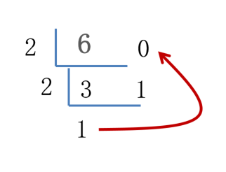
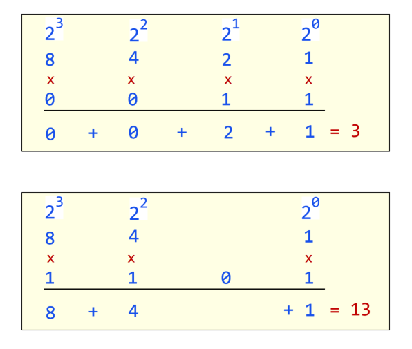

# 计算机进制转换

## 二进制

只有 0、1，按照逢 2 进 1 的方式表示数据

| 10 进制数 | 二进制数  |
| --------- | --------- |
| 0         | 0000 0000 |
| 1         | 0000 0001 |
| 2         | 0000 0010 |
| 3         | 0000 0011 |
| 4         | 0000 0100 |
| 5         | 0000 0101 |
| 6         | 0000 0110 |

**十进制转二进制**

- 除二取余法

  {data-zoomable}

  6 的二进制为 110， 短除法取余从下往上拼接余数得到 110

**二进制转十进制**

首先将二进制数补齐位数，**首位是 0 就代表是正整数**，**首位是 1 则代表是负整数**。

先看首位是 0 的正整数，补齐位数以后，将二进制中的位数分别将下边对应的值相乘，然后相加得到的就为十进制



## 八进制、十六进制

出现原因：为了便于观察和表示二进制，推出了八进制和十六进制

**每 3 位二进制作为一个单元**，最小数是 0，最大数是 7，共 8 个数字，这就是**八进制**。

```
97：01100001			01、100、001 -> 141
```

**每 4 位二进制作为一个单元**，最小数是 0，最大数是 15，共 16 个数字，依次用： 0~9 A B C D E F 代表就是**十六进制**。

```
97： 01100001		0110、0001  -> 61
250：11111010		1111、1010  -> FA
```

Java 程序中支持书写二进制、八进制、十六进制的数据，分别需要以 0B 或者 0b、0、0X 或者 0x 开头。
