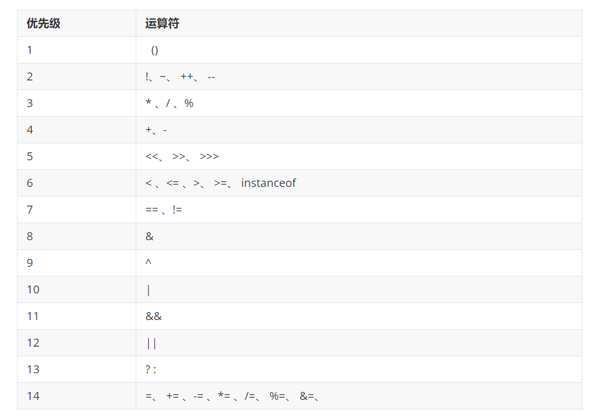

# Java 基础

## 数据类型

| 数据类型 | 关键字         | 取值范围                                             | 内存占用（字节数） |
| -------- | -------------- | ---------------------------------------------------- | ------------------ |
| 整数     | byte           | -128~127                                             | 1                  |
|          | short          | -32768~32767                                         | 2                  |
|          | int（默认）    | -2147483648~2147483647 (10 位数)                     | 4                  |
|          | long           | -9223372036854775808 ~ 9223372036854775807 (19 位数) | 8                  |
| 浮点数   | float          | 1.401298e-45 到 3.402823e+38                         | 4                  |
|          | double（默认） | 4.9000000e-324 到 1.797693e+308                      | 8                  |
| 字符     | char           | 0-65535                                              | 2                  |
| 布尔     | boolean        | true，false                                          | 1                  |

byte 取值范围：-128~127 解释说明：

**1byte = 8 bit**

[0,0,0,0,0,0,0,0]

在二进制中，第一位为符号位，后续 7 位二进制位可以存储的最大值为 2^7，即 128 个数值，0-127 正好 128 个数

[计算机中的进制转换](./hexadecimal "计算机中的进制转换")

## 数据类型转换

**自动类型转换**

- 为什么要进行类型转换？
  存在不同类型的变量赋值给其他类型的变量
- 自动类型转换是什么样的？
  类型范围小的变量，可以直接赋值给类型范围大的变量。

```
byte	-->	short	-->	int	-->	long	-->	float	-->	double
						↑
					   char
```

**强制类型转换**

```java
int a = 10;
byte b = (int)a;
```

- 强制类型转换**可能造成数据(丢失)溢出**
- 浮点型强转成整型，直接丢掉小数部分，保留整数部分返回

## 运算符

- 基本算数运算符
- +符号做连接符
- 自增自减运算符
- 赋值运算符
- 关系运算符
- 逻辑运算符
- 三元运算符
- 运算符优先级

{data-zoomable}

## 流程控制

- 顺序结构
- 分支结构 if else, switch
- 循环结构 for, while, do while

```java
// 输出3次HelloWorld
for (int i = 0; i < 3; i++) {
    System.out.println("Hello World");
}

```

## 键盘录入技术

```java
import java.util.Scanner;

public class Test {
    public static void main (String args[]){
        Scanner sc = new Scanner(System.in);

        sc.nextInt(); // 输入的整形数据

        sc.next(); // 输入的字符串
    }
}
```

## Random

```java
import java.util.Random;

public class Test {
    public static void main (String args[]){
        Random random = new Random();

        random.nextInt(10); // [0, 10) 左闭右开区间
        random.nextInt(100) + 1; // [1, 100] 之间的整数
    }
}
```

**附件**

[00、课程总体介绍.pptx](/files/00、课程总体介绍.pptx)

[01、Java 基础入门.pptx](/files/01、Java 基础入门.pptx)

[02、类型转换、常用运算符.pptx](/files/02、类型转换、常用运算符.pptx)

[03、流程控制.pptx](/files/03、流程控制.pptx)

[04、数组-副本.pptx](/files/04、数组-副本.pptx)

[05、方法.pptx](/files/05、方法.pptx)

[06、编程思维训练.pptx](/files/06、编程思维训练.pptx)

[07、面向对象基础.pptx](/files/07、面向对象基础.pptx)

[08、String、集合.pptx](/files/08、String、集合.pptx)

[09、黑马银行 ATM 系统.pptx](/files/09、黑马银行ATM系统.pptx)

[结课复习.pptx](/files/结课复习.pptx)
