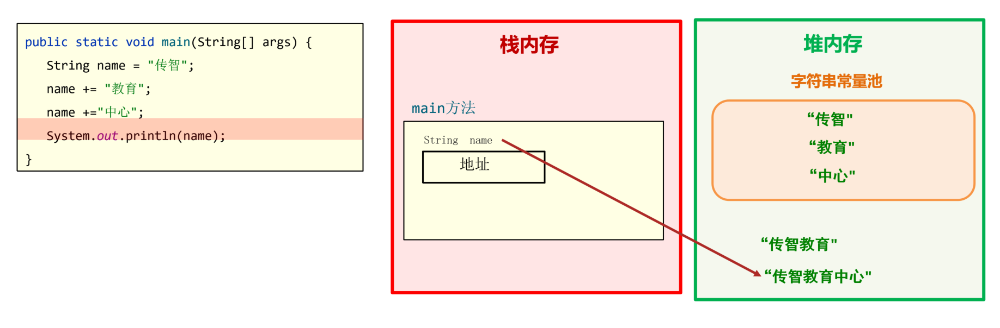

# 常用 API

**API: Application Programming Interface,应用程序编程接口**

Java API 文档 Java 8：https://docs.oracle.com/javase/8/docs/api/index.html

Java API 文档 Java 19：https://docs.oracle.com/en/java/javase/19/docs/api/index.html

## String

`java.lang.String` 类代表字符串，`String` 类定义的变量可以用于指向字符串对象

```java
 String string = "Hello World!";
```

特点：

- **String 其实常被称为不可变字符串类型，它的对象在创建后不能被更改。**
- **以 "" 方式给出的字符串对象，在字符串常量池中存储，而且相同内容只会在其中存储一份**
- **通过构造器 new 对象，每 new 一次都会产生一个新对象，保存在堆内存中**

```java
public static void main(String[] args) {
  String name = "传智";
  name += "教育";
  name +="中心";
  System.out.println(name);
}
```



"传智"，"教育"，"中心" 都存储在字符串常量池中是不能更改的，`String` 变量每次的修改其实都是产生并指向了新的字符串对象。

### 字符串内容比较

```java
import java.util.Scanner;

public class Main {
    public static void main(String[] args) {
        String sysLoginName = "itheima";
        Scanner sc = new Scanner(System.in);
        System.out.println("请您输入您的登录名称");

        String loginName = sc.next();
        System.out.println(sysLoginName == loginName); // false
    }
}

```

字符串的内容比较不适合用 "==" 比较

```java
public class String01 {
    public static void main(String[] args) {
        String s1 = new String("Hello");
        String s2 = "Hello";

        System.out.println(s1.equals(s2));
        System.out.println(s1 == s2);
    }
}
```

| 方法名                                                 | 说明                                                                         |
| ------------------------------------------------------ | ---------------------------------------------------------------------------- |
| public boolean equals (Object anObject)                | 将此字符串与指定对象进行比较。只关心字符内容是否一致！                       |
| public boolean equalsIgnoreCase (String anotherString) | 将此字符串与指定对象进行比较，忽略大小写比较字符串。只关心字符内容是否一致！ |
| ==                                                     | 内存地址相等                                                                 |

示例：

```java
  String s1 = "abc";
  String s2 = "ab";
  String s3 = s2 + "c";

  System.out.println(s1 == s3); // false
```

虽然字符串相同，但是内存地址不相同

**特例：**


```java
  String s1 = "abc";
  String s2 = "a" + "b" + "c";
  System.out.println(s1 == s2); // true
```


**API**

| 方法名                                                       | 说明                                                     |
| ------------------------------------------------------------ | -------------------------------------------------------- |
| public int length()                                          | 返回此字符串的长度                                       |
| public char charAt(int index)                                | 获取某个索引位置处的字符                                 |
| public char[] toCharArray()：                                | 将当前字符串转换成字符数组返回                           |
| public String substring(int beginIndex, int endIndex)        | 根据开始和结束索引进行截取，得到新的字符串（包前不包后） |
| public String substring(int beginIndex)                      | 从传入的索引处截取，截取到末尾，得到新的字符串           |
| public String replace(CharSequence target, CharSequence replacement) | 使用新值，将字符串中的旧值替换，得到新的字符串           |
| public String[] split(String regex)                          | 根据传入的规则切割字符串，得到字符串数组返回             |


## ArrayList

**数组**： 类型确定，长度固定
**集合**：集合的大小不固定，启动后可以动态变化，类型也可以选择不固定


```java
import java.util.ArrayList;

public class ArrayList01 {
    public static void main(String[] args) {
        ArrayList arrayList = new ArrayList<>();

        arrayList.add("Hello");
        arrayList.add("World");
        arrayList.add(100);
        arrayList.add(99.99);
        arrayList.add(true);
        arrayList.add(1, "测试");

        System.out.println(arrayList);
    }
}
```


| 方法名                               | 说明                               |
| ------------------------------------ | ---------------------------------- |
| public boolean add(E e)              | 将指定的元素追加到此集合的末尾     |
| public void add(int index,E element) | 在此集合中的指定位置插入指定的元素 |
|                                      |                                    |

集合对象的**泛型**

```java
import java.util.ArrayList;

public class ArrayList02 {
    public static void main(String[] args) {
        ArrayList<String> arrayList = new ArrayList<>();

        arrayList.add("Hello");
        arrayList.add("world");
//        arrayList.add(1); 编译时报错


        ArrayList<Integer> arrayList1 = new ArrayList<>();
//        ArrayList<int> arrayList1 = new ArrayList<>(); 编译时报错

        arrayList1.add(12);
    }
}

```

泛型只能支持引用数据类型，不支持基本数据类型


ArrayList 常用方法

| 方法名称                          | 说明                                   |
| --------------------------------- | -------------------------------------- |
| public E get(int index)           | 返回指定索引处的元素                   |
| public int size()                 | 返回集合中的元素的个数                 |
| public E remove(int index)        | 删除指定索引处的元素，返回被删除的元素 |
| public boolean remove(Object o)   | 删除指定的元素，返回删除是否成功       |
| public E set(int index,E element) | 修改指定索引处的元素，返回被修改的元素 |


## StringBuilder

是一个可变的字符串的操作类，我们可以把它看成是一个对象容器。操作字符串的性能比 String 更高（如拼接、修改等）

```java
StringBuilder stringBuilder = new StringBuilder();

stringBuilder.append("Hello");
stringBuilder.append("world");
stringBuilder.append(123);
stringBuilder.append(true);

System.out.println(stringBuilder.reverse().toString());
```


## 日期相关

### Date、SimpleDateFormat

```java
public class Test01 {
    public static void main(String[] args) throws ParseException {
        Date date = new Date(1679643305019L);
        System.out.println(date);
        System.out.println(date.getTime());

        date.setTime(System.currentTimeMillis());
        System.out.println(date);

//        日期对象格式化为字符串
        SimpleDateFormat simpleDateFormat = new SimpleDateFormat("YYYY-MM-dd hh:mm:ss");

        String s = simpleDateFormat.format(date);
        System.out.println(s);

//        字符串格式化日期对象
        Date date1 = simpleDateFormat.parse(s);

        System.out.println(date1);

    }
}
```


### Calendar

Calendar代表了系统此刻日期对应的日历对象

Calendar是一个**抽象类，不能直接创建对象**

```java
public class Test02 {
    public static void main(String[] args) {
        Calendar calendar = Calendar.getInstance();

        System.out.println(calendar.getTime()); // Fri Mar 24 16:17:36 CST 2023
        System.out.println(calendar.get(Calendar.YEAR)); //  2023

//        在当前日期增加一天
        calendar.add(Calendar.DATE, 1);
        System.out.println(calendar.getTime()); // Sat Mar 25 16:17:36 CST 2023

        System.out.println(calendar.getTimeInMillis());
    }

}
```

### JDK 8 新增日期

- LocalDate：不包含具体时间的日期。

- LocalTime：不含日期的时间。

- LocalDateTime：包含了日期及时间。

- Instant：代表的是时间戳。

- DateTimeFormatter 用于做时间的格式化和解析的

- Duration:用于计算两个“时间”间隔 

- Period:用于计算两个“日期”间隔

  

```java
public class Test03 {
    public static void main(String[] args) {
        LocalDate localDate = LocalDate.now();
        LocalTime localTime = LocalTime.now();
        
        System.out.println(localDate); // 2023-03-24
        System.out.println(localTime); // 16:27:38.922627100

        LocalDate localDate1 = LocalDate.of(2099 , 11,11);
        LocalTime localTime1 = LocalTime.of(11, 11, 11);
        LocalDateTime localDateTime1 = LocalDateTime.of(2020, 10, 6, 13, 23, 43);

        System.out.println(localDate1); // 2099-11-11
        System.out.println(localTime1); // 11:11:11
        System.out.println(localDateTime1); // 2020-10-06T13:23:43

//        转换

        LocalDateTime localDateTime = LocalDateTime.now();
        System.out.println(localDateTime); // 2023-03-24T16:28:40.547405200

        System.out.println(localDateTime.toLocalDate()); // 2023-03-24
        System.out.println(localDateTime.toLocalTime()); // 16:28:40.547405200
    }
}
```

### Instant时间戳

```java
public class Test04 {
    public static void main(String[] args) {
        Instant instant = Instant.now();
        System.out.println("当前时间戳是：" + instant); // 当前时间戳是：2023-03-24T08:31:24.243696900Z
        Date date = Date.from(instant);
        System.out.println("当前时间戳是：" + date); // 当前时间戳是：Fri Mar 24 16:31:24 CST 2023
        instant = date.toInstant();
        System.out.println(instant); // 2023-03-24T08:31:24.243Z
    }
}
```

### DateTimeFormatter

```java
public class Test05 {
    public static void main(String[] args) {
        LocalDateTime localDateTime = LocalDateTime.now();

        DateTimeFormatter dateTimeFormatter = DateTimeFormatter.ofPattern("yyyy-MM-dd HH:mm:ss");

//        正反两面都可以，不担心用谁格式化谁
        String dateTime = localDateTime.format(dateTimeFormatter);
        System.out.println(dateTime);

        String dateTime2 = dateTimeFormatter.format(localDateTime);
        System.out.println(dateTime2);
    }
}
```

### Period(计算两个“日期”间隔)

```java
public class Test06 {
    public static void main(String[] args) {
        LocalDate today = LocalDate.now();
        System.out.println(today);     // 2021-03-01LocalDate
        LocalDate  birthDate = LocalDate.of(1995, 1, 11);
        System.out.println(birthDate); // 1995-01-11
        Period period = Period.between(birthDate, today);
        System.out.printf("年龄 : %d 年 %d 月 %d 日", period.getYears(), period.getMonths(), period.getDays());
        // 年龄 : 28 年 2 月 13 日
    }
}
```

### Duration(计算两个“时间”间隔)

```java
public class Test07 {
    public static void main(String[] args) {
        LocalDateTime today = LocalDateTime.now();
        System.out.println(today);

        LocalDateTime birthDate = LocalDateTime.of(1990, 10, 1, 10, 50, 30);
        System.out.println(birthDate);

        Duration duration = Duration.between(birthDate, today);//第二个参数减第一个参数

        System.out.println(duration.toDays());//两个时间差的天数
        System.out.println(duration.toHours());//两个时间差的小时数
        System.out.println(duration.toMinutes());//两个时间差的分钟数
        System.out.println(duration.toMillis());//两个时间差的毫秒数
        System.out.println(duration.toNanos());//两个时间差的纳秒数

    }
}
```


### ChronoUnit

ChronoUnit 类可用于在单个时间单位内测量一段时间，这个**工具类是最全的**了，可以**用于比较所有的时间单位**

```java
public class Test08 {
    public static void main(String[] args) {
        LocalDateTime today = LocalDateTime.now();
        System.out.println(today);

        LocalDateTime birthDate = LocalDateTime.of(1990, 10, 1, 10, 50, 30);
        System.out.println(birthDate);

        System.out.println("相差的年数：" + ChronoUnit.YEARS.between(birthDate, today));
        System.out.println("相差的月数：" + ChronoUnit.MONTHS.between(birthDate, today));
        System.out.println("相差的周数：" + ChronoUnit.WEEKS.between(birthDate, today));
        System.out.println("相差的天数：" + ChronoUnit.DAYS.between(birthDate, today));
        System.out.println("相差的时数：" + ChronoUnit.HOURS.between(birthDate, today));
        System.out.println("相差的分数：" + ChronoUnit.MINUTES.between(birthDate, today));
        System.out.println("相差的秒数：" + ChronoUnit.SECONDS.between(birthDate, today));
        System.out.println("相差的毫秒数：" + ChronoUnit.MILLIS.between(birthDate, today));
        System.out.println("相差的微秒数：" + ChronoUnit.MICROS.between(birthDate, today));
        System.out.println("相差的纳秒数：" + ChronoUnit.NANOS.between(birthDate, today));
        System.out.println("相差的半天数：" + ChronoUnit.HALF_DAYS.between(birthDate, today));
        System.out.println("相差的十年数：" + ChronoUnit.DECADES.between(birthDate, today));
        System.out.println("相差的世纪（百年）数：" + ChronoUnit.CENTURIES.between(birthDate, today));
        System.out.println("相差的千年数：" + ChronoUnit.MILLENNIA.between(birthDate, today));
        System.out.println("相差的纪元数：" + ChronoUnit.ERAS.between(birthDate, today));
    }
}
```

