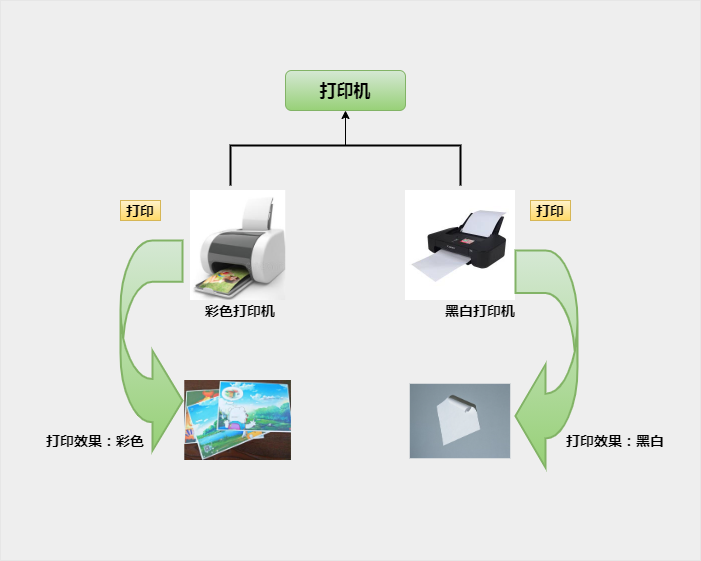

# 面向对象

## 成员属性、方法、构造器

```java
public class Test {
    public static void main(String[] args) {
          // 1、成员变量（代表属性,一般是名词)
          String name = "apple";
          double price = 99.99;

          // 2、成员方法（代表行为,一般是动词）
          public void start(){

          }
          public void run(){

          }

          // 3、构造器 （后几节再说）
          public Test(){}

          public Test(String name, double price){
            this.name = name;
            this.price = price;
          }

          // 4、代码块 （后面再学）
          // 5、内部类 （后面再学）
    }
```

创建类

```java
Test t = new Test("orange", 98.00);
System.out.println(t.name); // orange
System.out.println(t.price); // 98.00

```

- 无参数构造器：（默认存在的）：初始化对象时，成员变量的数据均采用默认值
- 有参数构造器：在初始化对象的时候，同时可以接收参数为对象进行赋值

## this 关键字

**出现在构造器和成员方法中，代表当前对象的地址。可以用于指定访问当前对象的成员。**

## 面向对象三大特征

- 封装
- 继承
- 多态

### 封装

如何正确设计对象的属性和方法。对象代表什么，就得封装对应的数据，并提供数据对应的行为。

优点：让编程变得很简单，有什么事，找对象，调方法就行。

**如何进行封装更好？**

成员变量使用 `private` (私有、隐藏)关键字修饰
为每个成员变量提供配套 `public` 修饰的的 `getter`、`setter` 方法暴露其取值和赋值

```java
public class Student {
    private int age;

    public int getAge() {
        return age;
    }

    public void setAge(int age) {
        if (age >= 0 && age <= 200) {
            this.age = age;
        } else {
            System.out.println("请检查年龄数值!!");
        }
    }
}
```

### JavaBean(实体类)

JavaBean 是一种 JAVA 语言写成的可重用组件。JavaBean 符合一定规范编写的 Java 类，不是一种技术，而是一种规范

标准 JavaBean 规范：

- 成员变量使用 `private` 修饰
- 提供成员变量对应的 `setXxx()` / `getXxx()`方法
- 必须提供一个无参构造器；有参数构造器是可写可不写的
- 这个类应是可序列化的。实现 `serializable` 接口

### POJO(Plain Ordinary Java Object)

简单普通的 java 对象。主要用来指代那些没有遵循特定的 java 对象模型，约定或者框架的对象。

POJO 的内在含义是指那些:
有一些 `private` 的参数作为对象的属性，然后针对每一个参数定义 `get` 和 `set` 方法访问的接口。
没有从任何类继承、也没有实现任何接口，更没有被其它框架侵入的 java 对象。

### 示例：

> **需求**
> 使用面向对象编程，模仿电影信息的展示。
>
> **分析**
> 一部电影是一个 Java 对象，需要先设计电影类，再创建电影对象。
> 三部电影对象可以采用数组存储起来。
> 依次遍历数组中的每个电影对象，取出其信息进行展示。

```java
public class Movie {
    private String name;
    private double score;
    private String actor;

    public Movie(String name, double score, String actor) {
        this.name = name;
        this.score = score;
        this.actor = actor;
    }

    public String getName() {
        return name;
    }

    public double getScore() {
        return score;
    }

    public String getActor() {
        return actor;
    }

    public void setName(String name) {
        this.name = name;
    }

    public void setScore(double score) {
        this.score = score;
    }

    public void setActor(String actor) {
        this.actor = actor;
    }

}


```

```java
public class Main {
    public static void main(String[] args) {
        Movie[] movies = new Movie[3];
        movies[0] = new Movie("《长津湖》", 9.7, "吴京");
        movies[1] = new Movie("《我和我的父辈》", 9.6, "吴京");
        movies[2] = new Movie("《扑水少年》", 9.5, "王川");

        for (int i = 0; i < movies.length; i++) {
            Movie movie = movies[i];
            System.out.println("片名：" + movie.getName());
            System.out.println("评分：" + movie.getScore());
            System.out.println("主演：" + movie.getActor());
        }
    }
}
```

### 继承

提供一个关键字 `extends`，用这个关键字，我们可以让一个类和另一个类建立起父子关系

```java
public class Student extends People {}
```

继承的优点：**当子类继承父类后，就可以直接使用父类公共的属性和方法了，可以提高代码的复用性**

继承的特点：

- 子类可以继承父类的属性和行为，但是**子类不能继承父类的构造器**。
- Java 是**单继承模式**：一个类只能继承一个直接父类。
- Java 不支持多继承、但是支持多层继承。
- Java 中所有的类都是 Object 类的子类。

在子类方法中访问成员（成员变量、成员方法）满足：**就近原则**

- 先子类局部范围找
- 然后子类成员范围找
- 然后父类成员范围找，如果父类范围还没有找到则报错。

如果子父类中，出现了重名的成员，会优先使用子类的，此时如果一定要在子类中使用父类的怎么办？
可以通过 `super` 关键字，指定访问父类的成员。

**子类是否可以继承父类的私有成员**？
可以，只是不能直接访问

### 多态

多态是同一个行为具有多个不同表现形式或形态的能力。

多态就是同一个接口，使用不同的实例而执行不同操作，如图所示：两张图说明多态




**重写（@Override）**

- 重写方法的名称、形参列表必须与被重写方法的名称和参数列表一致
- 私有方法不能被重写
- 子类重写父类方法时，访问权限必须大于或者等于父类
- 子类不能重写父类的静态方法，如果重写会报错的

```java
public class Animal {
    public String name;
    public int age;

    public Animal() {
    }

    public Animal(String name, int age) {
        this.name = name;
        this.age = age;
    }

    public String getName() {
        return name;
    }

    public int getAge() {
        return age;
    }

    public void setName(String name) {
        this.name = name;
    }

    public void setAge(int age) {
        this.age = age;
    }
}
```

```java
public class Dog extends Animal {
    public Dog(String name, int age) {
        super(name, age);
    }

    @Override
    public String getName(){
        System.out.println("Dog getName...");
        return super.getName();
    }
}
```

**子类继承父类后构造器的特点**

子类中所有的构造器默认都会先访问父类中无参的构造器，再执行自己

**为什么？**
子类在初始化的时候，有可能会使用到父类中的数据，如果父类没有完成初始化，子类将无法使用父类的数据。
子类初始化之前，一定要调用父类构造器先完成父类数据空间的初始化。

**怎么调用父类构造器的？**
子类构造器的第一行语句默认都是：`super()` 不写也存在。

**super 调用父类有参数构造器的作用：**
初始化继承自父类的数据。

如果父类中没有无参数构造器，只有有参构造器，会出现什么现象呢？
会报错。因为子类默认是调用父类无参构造器的。

**如何解决？**
子类构造器中可以通过书写 super(…)，手动调用父类的有参数构造器

意思是：父类可以不写无参数构造器，子类构造器通过 super 关键字调用父类有参数构造器

```java
public class Student {
    private String schoolName;
    private String name;

    public Student(String name){
          this(name , “黑马培训中心”);
    }

    public Student(String name , String schoolName ){
          this.name = name;
          this.schoolName = schoolName;
    }
}

```

**this(...)和 super(…)使用注意点：**

- 子类通过 this (...）去调用本类的其他构造器，本类其他构造器会通过 super 去手动调用父类的构造器，最终还是会调用父类构造器的。
- 注意：this(…) super(…) 都只能放在构造器的第一行，所以二者不能共存在同一个构造器中


## 包

包是用来分门别类的管理各种不同类的，类似于文件夹、建包利于程序的管理和维护。

书写格式：package 公司域名倒写.技术名称。报名建议全部英文小写，且具备意义

```java
package com.itheima.javabean;
```

相同包下的类可以直接访问，不同包下的类必须导包,才可以使用！导包格式：import 包名.类名;

假如一个类中需要用到不同类，而这个两个类的名称是一样的，那么**默认只能导入一个类，另一个类要带包名访问**,如下：

```java
com.example.MyClass myObject = new com.example.MyClass();
```


## 权限修饰符

private -> 缺省 -> protected -> public 


| **修饰符** | **同一个类中** | 同一个包中其他类 | 不同包下的子类 |
| ---------- | -------------- | ---------------- | -------------- |
| private    | √              |                  |                |
| 缺省       | √              | √                |                |
| protected  | √              | √                | √              |
| public     | √              | √                | √              |


## final

**final的作用**

- final 关键字是最终的意思，可以修饰（类、方法、变量）
- 修饰类：表明该类是最终类，不能被继承。
- 修饰方法：表明该方法是最终方法，不能被重写。
- 修饰变量：表示该变量第一次赋值后，不能再次被赋值(有且仅能被赋值一次)。


**final修饰变量的注意**

- final修饰的变量是基本类型：那么变量存储的数据值不能发生改变。
- final修饰的变量是引用类型：那么变量存储的地址值不能发生改变，但是地址指向的对象内容是可以发生变化的。


## 常量

使用了 **public static final** 修饰的成员变量

常量名的命名规范：英文单词全部大写，多个单词下划线连接起来

```java
public class Constant {
    public static final String SCHOOL_NAME  = “传智教育";
    public static final String LOGIN_NAME  = “admin";
    public static final String PASS_WORD  = “123456";
} 

```


## 枚举

为了做信息的标志和信息的分类

```java
 修饰符 enum 枚举名称{
    第一行都是罗列枚举类实例的名称。
}
```

```java
enum Season{
    SPRING , SUMMER , AUTUMN , WINTER;
}

```

```java
C// Compiled from "Season.java"
    
public final class Season extends java.lang.Enum<Season> {
    public static final Season SPRING = new Season();
    public static final Season SUMMER = new Season();
    public static final Season AUTUMN = new Season();
    public static final Season WINTER = new Season();
    public static Season[] values();
    public static Season valueOf(java.lang.String);
}

```

**枚举的特征：**

- 枚举类都是继承了枚举类型：`java.lang.Enum`
- 枚举都是最终类，不可以被继承。
- 构造器都是私有的，枚举对外不能创建对象。
- 枚举类的第一行默认都是罗列枚举对象的名称的。
- 枚举类相当于是多例模式。


## 抽象类

- 在Java中abstract是抽象的意思，可以修饰类、成员方法。
- abstract修饰类，这个类就是抽象类；修饰方法，这个方法就是抽象方法。

```java
修饰符 abstract class 类名{ 
	修饰符 abstract 返回值类型 方法名称(形参列表)；
}
```

```java
public abstract class Animal{
    public abstract void run();
}

```


- 抽象方法只有方法签名，不能声明方法体。
- 一个类中如果定义了抽象方法，这个类必须声明成抽象类，否则报错。
- 类有的成员（成员变量、方法、构造器）抽象类都具备
- 抽象类中不一定有抽象方法，有抽象方法的类一定是抽象类
- 一个类继承了抽象类必须重写完抽象类的全部抽象方法，否则这个类也必须定义成抽象类。
- 不能用abstract修饰变量、代码块、构造器。
- 最重要的特征：得到了抽象方法，失去了创建对象的能力（有得有失）


**final和abstract是什么关系？**

- 互斥关系
- abstract定义的抽象类作为模板让子类继承，final定义的类不能被继承。
- 抽象方法定义通用功能让子类重写，final定义的方法子类不能重写。


```java
// 定义一个抽象类Animal
public abstract class Animal {
    // 抽象方法，子类必须实现
    public abstract void makeSound();

    // 非抽象方法，子类可以选择是否覆盖
    public void sleep() {
        System.out.println("睡觉中...");
    }
}

// 定义一个继承自Animal的子类Dog
public class Dog extends Animal {
    // 实现抽象方法
    public void makeSound() {
        System.out.println("汪汪汪");
    }
}

// 定义另一个继承自Animal的子类Cat
public class Cat extends Animal {
    // 实现抽象方法
    public void makeSound() {
        System.out.println("喵喵喵");
    }

    // 覆盖父类的非抽象方法
    public void sleep() {
        System.out.println("蜷缩睡觉中...");
    }
}

// 在主函数中使用抽象类
public class Main {
    public static void main(String[] args) {
        // 无法实例化抽象类
        // Animal animal = new Animal();

        // 可以通过子类实例化
        Animal dog = new Dog();
        Animal cat = new Cat();

        // 调用抽象方法
        dog.makeSound(); // 输出 "汪汪汪"
        cat.makeSound(); // 输出 "喵喵喵"

        // 调用非抽象方法
        dog.sleep(); // 输出 "睡觉中..."
        cat.sleep(); // 输出 "蜷缩睡觉中..."
    }
}

```


## 接口 interface

```java
public interface 接口名 {
       // 常量
       // 抽象方法
} 

```

- 接口不能实例化
- 接口中的成员都是public修饰的，写不写都是，因为规范的目的是为了公开化


**实现接口**

使用 implements 实现接口，实现接口的类称为**实现类**

```java
修饰符 class 实现类 implements 接口1, 接口2, 接口3 , ... {
}

```

**接口可以被类单实现，也可以被类多实现**


**一个类实现接口，必须重写完全部接口的全部抽象方法，否则这个类需要定义成抽象类**


**接口和类的继承注意事项：**

- 类和类的关系：单继承。
- 类和接口的关系：多实现。
- 接口和接口的关系：多继承，一个接口可以同时继承多个接口。


```java
interface A {
    void methodA();
}

interface B {
    void methodB();
}

interface C extends A, B {
    void methodC();
}

class D implements C {
    public void methodA() {
        System.out.println("Method A");
    }

    public void methodB() {
        System.out.println("Method B");
    }

    public void methodC() {
        System.out.println("Method C");
    }
}

public class Main {
    public static void main(String[] args) {
        D obj = new D();
        obj.methodA();
        obj.methodB();
        obj.methodC();
    }
}

```


## 内部类

内部类就是定义在一个类里面的类，里面的类可以理解成（寄生），外部类可以理解成（宿主）。

1. 静态内部类

   ```java
   public class Outer{
   	// 静态成员内部类
   	public static class Inner{}
   }
   
   Outer.Inner in =  new Outer.Inner();
   
   ```

   - 静态内部类中**可以**直接访问外部类的静态成员
   - 静态内部类**不可以**直接访问外部类的实例成员

   

2. 成员内部类

   ```java
   public class Outer {
       // 成员内部类
       public class Inner {}
   }
   
   Outer.Inner in =  new Outer().new  Inner();
   ```

   - **可以**直接访问外部类的静态成员
   - **可以**直接访问外部类的实例成员

3. 局部内部类

   ```java
   public class OuterClass {
     void someMethod() {
       // 定义一个局部内部类
       class LocalInnerClass {
         // 局部内部类的内容
       }
   
       // 使用局部内部类
       LocalInnerClass inner = new LocalInnerClass();
       inner.someMethod();
     }
   }
   
   ```

   

4. 匿名内部类

   ```java
   Animal a = new Employee() {
       public void run() {}
   };
   
   a. run();
   ```

   - 匿名内部类是一个没有名字的内部类，同时也代表一个对象。
   - 匿名内部类的对象类型，相当于是当前new的那个类型的子类类型


**面试题：**

```java
public class People {
    private int heartbeat = 150;
    public class Heart {
        private int heartbeat = 110;

        public void show() {
            int heartbeat = 78;
            System.out.println(heartbeat); // 78
            System.out.println(this.heartbeat); // 110
            System.out.println(People.this.heartbeat); // 150
        }
    }
}

public class Main {
    public static void main(String[] args) {
        People people = new People();

        people.new Heart().show();
    }
}
```


## 包装类

Java为了实现一切皆对象，为8种基本类型提供了对应的引用类型

集合和泛型其实也只能支持包装类型，不支持基本数据类型


特点：

- 自动装箱：基本类型的数据和变量可以直接赋值给包装类型的变量。

- 自动拆箱：包装类型的变量可以直接赋值给基本数据类型的变量。

- 包装类的变量的默认值可以是null，容错率更高

- 可以把基本类型的数据转换成字符串类型(用处不大)

  ```java
  调用toString()方法得到字符串结果。
  调用Integer.toString(基本类型的数据)。
  ```

  

- 可以把字符串类型的数值转换成真实的数据类型（真的很有用）

  ```java
  Integer.parseInt(“字符串类型的整数”)
  Double.parseDouble(“字符串类型的小数”)。
  ```

  

| 基本数据类型 | 引用数据类型 |
| ------------ | ------------ |
| byte         | Byte         |
| short        | Short        |
| int          | Integer      |
| long         | Long         |
| char         | Character    |
| float        | Float        |
| double       | Double       |
| boolean      | Boolean      |

```java
Integer myInt = new Integer(42);

// 注意，自 Java 9 开始，Java 已经废弃了许多过时的包装类构造函数。相反，Java 推荐使用静态工厂方法 valueOf() 来创建包装类实例
Integer myInt = Integer.valueOf(42);

```

