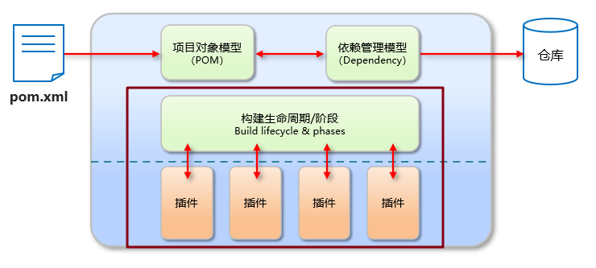
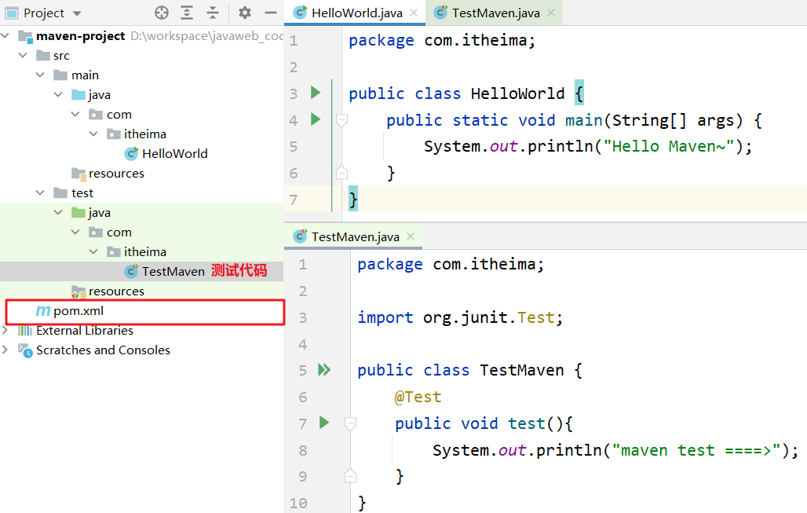
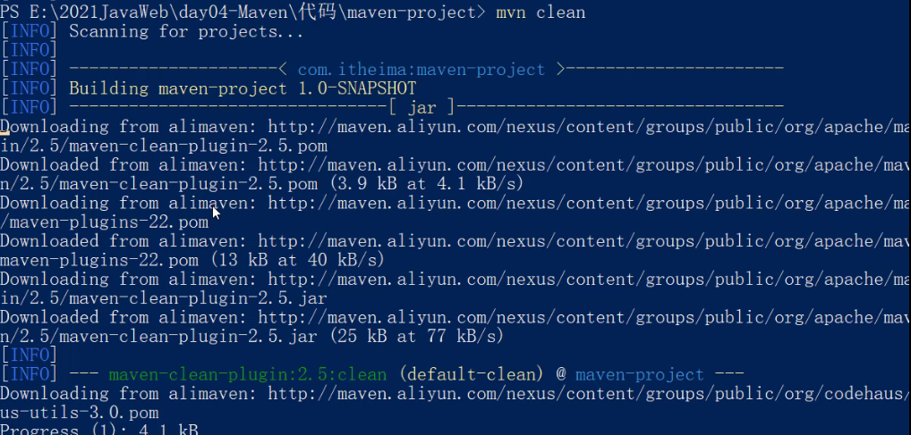
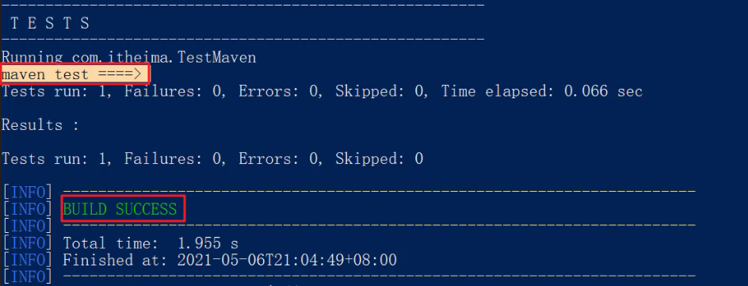
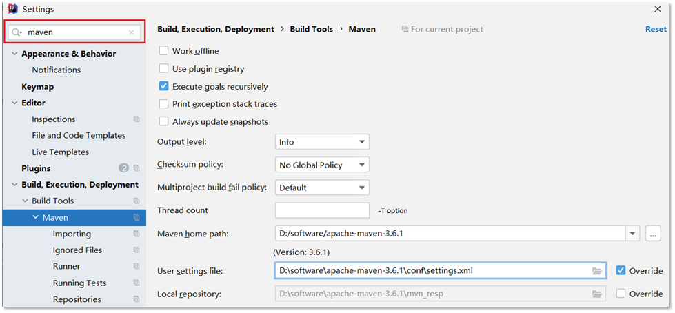
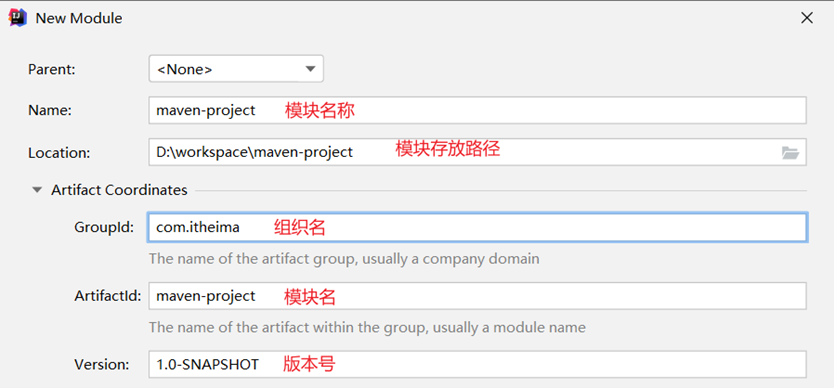
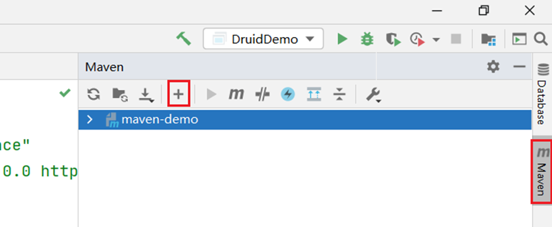
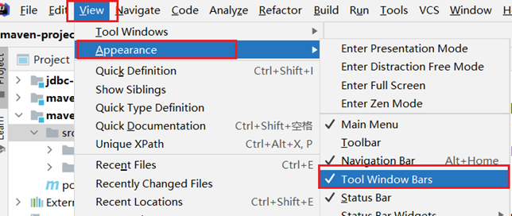
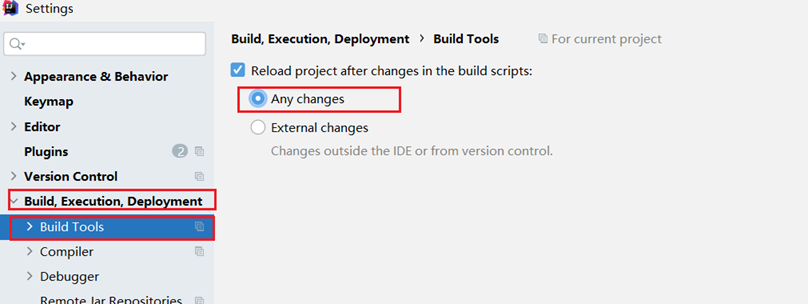

# Maven

**目标**

> - 能够使用 Maven 进行项目的管理
> - 能够完成 Mybatis 代理方式查询数据
> - 能够理解 Mybatis 核心配置文件的配置

Maven 是专门用于管理和构建 Java 项目的工具，它的主要功能有：

- 提供了一套标准化的项目结构

- 提供了一套标准化的构建流程（编译，测试，打包，发布……）

- 提供了一套依赖管理机制

**标准化的项目结构：**

项目结构我们都知道，每一个开发工具（IDE）都有自己不同的项目结构，它们互相之间不通用。我再 eclipse 中创建的目录，无法在 idea 中进行使用，这就造成了很大的不方便，如下图:前两个是以后开发经常使用的开发工具

{data-zoomable}

而 Maven 提供了一套标准化的项目结构，所有的 IDE 使用 Maven 构建的项目完全一样，所以 IDE 创建的 Maven 项目可以通用。如下图右边就是 Maven 构建的项目结构。

{data-zoomable}

**标准化的构建流程：**

{data-zoomable}

如上图所示我们开发了一套系统，代码需要进行编译、测试、打包、发布，这些操作如果需要反复进行就显得特别麻烦，而 Maven 提供了一套简单的命令来完成项目构建。

**依赖管理：**

依赖管理其实就是管理你项目所依赖的第三方资源（jar 包、插件）。如之前我们项目中需要使用 JDBC 和 Druid 的话，就需要去网上下载对应的依赖包（当前之前是老师已经下载好提供给大家了），复制到项目中，还要将 jar 包加入工作环境这一系列的操作。如下图所示

{data-zoomable}

而 Maven 使用标准的 ==坐标== 配置来管理各种依赖，只需要简单的配置就可以完成依赖管理。

{data-zoomable}

如上图右边所示就是 mysql 驱动包的坐标，在项目中只需要写这段配置，其他都不需要我们担心，Maven 都帮我们进行操作了。

市面上有很多构建工具，而 Maven 依旧还是主流构建工具，如下图是常用构建工具的使用占比

{data-zoomable}

## 1.1 Maven 简介

> ==Apache Maven== 是一个项目管理和构建==工具==，它基于项目对象模型(POM)的概念，通过一小段描述信息来管理项目的构建、报告和文档。
>
> 官网 ：<http://maven.apache.org/>

通过上面的描述大家只需要知道 Maven 是一个工具即可。Apache 是一个开源组织，将来我们会学习很多 Apache 提供的项目。

### 1.1.1 Maven 模型

- 项目对象模型 (Project Object Model)
- 依赖管理模型(Dependency)
- 插件(Plugin)

{data-zoomable}

如上图所示就是 Maven 的模型，而我们先看紫色框框起来的部分，他就是用来完成 `标准化构建流程` 。如我们需要编译，Maven 提供了一个编译插件供我们使用，我们需要打包，Maven 就提供了一个打包插件提供我们使用等。

{data-zoomable}

上图中紫色框起来的部分，项目对象模型就是将我们自己抽象成一个对象模型，有自己专属的坐标，如下图所示是一个 Maven 项目：

{data-zoomable}

依赖管理模型则是使用坐标来描述当前项目依赖哪儿些第三方 jar 包，如下图所示

{data-zoomable}

上述 Maven 模型图中还有一部分是仓库。如何理解仓库呢？

### 1.1.2 仓库

大家想想这样的场景，我们创建 Maven 项目，在项目中使用坐标来指定项目的依赖，那么依赖的 jar 包到底存储在什么地方呢？其实依赖 jar 包是存储在我们的本地仓库中。而项目运行时从本地仓库中拿需要的依赖 jar 包。

**仓库分类：**

- 本地仓库：自己计算机上的一个目录

- 中央仓库：由 Maven 团队维护的全球唯一的仓库

  - 地址： <https://repo1.maven.org/maven2/>

- 远程仓库(私服)：一般由公司团队搭建的私有仓库

  今天我们只学习远程仓库的使用，并不会搭建。

当项目中使用坐标引入对应依赖 jar 包后，首先会查找本地仓库中是否有对应的 jar 包：

- 如果有，则在项目直接引用;

- 如果没有，则去中央仓库中下载对应的 jar 包到本地仓库。

{data-zoomable}

如果还可以搭建远程仓库，将来 jar 包的查找顺序则变为：

> 本地仓库 --> 远程仓库--> 中央仓库

{data-zoomable}

## 1.2 Maven 安装配置

- 解压 apache-maven-3.6.1.rar 既安装完成

  {data-zoomable}

  > 建议解压缩到没有中文、特殊字符的路径下。如课程中解压缩到 `D:\software` 下。

  解压缩后的目录结构如下：

  {data-zoomable}

  - bin 目录 ： 存放的是可执行命令。mvn 命令重点关注。
  - conf 目录 ：存放 Maven 的配置文件。`settings.xml` 配置文件后期需要修改。
  - lib 目录 ：存放 Maven 依赖的 jar 包。Maven 也是使用 java 开发的，所以它也依赖其他的 jar 包。

- 配置环境变量 MAVEN_HOME 为安装路径的 bin 目录

  `此电脑` 右键 --> `高级系统设置` --> `高级` --> `环境变量`

  在系统变量处新建一个变量 `MAVEN_HOME`

  {data-zoomable}

  在 `Path` 中进行配置

  {data-zoomable}

  打开命令提示符进行验证，出现如图所示表示安装成功

  {data-zoomable}

- 配置本地仓库

  修改 conf/settings.xml 中的 \<localRepository\> 为一个指定目录作为本地仓库，用来存储 jar 包。

  {data-zoomable}

- 配置阿里云私服

  中央仓库在国外，所以下载 jar 包速度可能比较慢，而阿里公司提供了一个远程仓库，里面基本也都有开源项目的 jar 包。

  修改 conf/settings.xml 中的 \<mirrors\>标签，为其添加如下子标签：

  ```xml
  <mirror>
      <id>alimaven</id>
      <name>aliyun maven</name>
      <url>http://maven.aliyun.com/nexus/content/groups/public/</url>
      <mirrorOf>central</mirrorOf>
  </mirror>
  ```

## 1.3 Maven 基本使用

### 1.3.1 Maven 常用命令

> - compile ：编译
>
> - clean：清理
>
> - test：测试
>
> - package：打包
>
> - install：安装

**命令演示：**

在 `资料\代码\maven-project` 提供了一个使用 Maven 构建的项目，项目结构如下：

{data-zoomable}

而我们使用上面命令需要在磁盘上进入到项目的 `pom.xml` 目录下，打开命令提示符

{data-zoomable}

**编译命令演示：**

```java
mvn compile
```

执行上述命令可以看到：

- 从阿里云下载编译需要的插件的 jar 包，在本地仓库也能看到下载好的插件
- 在项目下会生成一个 `target` 目录

{data-zoomable}

同时在项目下会出现一个 `target` 目录，编译后的字节码文件就放在该目录下

{data-zoomable}

**清理命令演示：**

```
mvn clean
```

执行上述命令可以看到

- 从阿里云下载清理需要的插件 jar 包
- 删除项目下的 `target` 目录

{data-zoomable}

**打包命令演示：**

```
mvn package
```

执行上述命令可以看到：

- 从阿里云下载打包需要的插件 jar 包
- 在项目的 `terget` 目录下有一个 jar 包（将当前项目打成的 jar 包）

{data-zoomable}

**测试命令演示：**

```
mvn test
```

该命令会执行所有的测试代码。执行上述命令效果如下

{data-zoomable}

**安装命令演示：**

```
mvn install
```

该命令会将当前项目打成 jar 包，并安装到本地仓库。执行完上述命令后到本地仓库查看结果如下：

{data-zoomable}

### 1.3.2 Maven 生命周期

Maven 构建项目生命周期描述的是一次构建过程经历经历了多少个事件

Maven 对项目构建的生命周期划分为 3 套：

- clean ：清理工作。
- default ：核心工作，例如编译，测试，打包，安装等。
- site ： 产生报告，发布站点等。这套声明周期一般不会使用。

同一套生命周期内，执行后边的命令，前面的所有命令会自动执行。例如默认（default）生命周期如下：

{data-zoomable}

当我们执行 `install`（安装）命令时，它会先执行 `compile`命令，再执行 `test` 命令，再执行 `package` 命令，最后执行 `install` 命令。

当我们执行 `package` （打包）命令时，它会先执行 `compile` 命令，再执行 `test` 命令，最后执行 `package` 命令。

默认的生命周期也有对应的很多命令，其他的一般都不会使用，我们只关注常用的：

{data-zoomable}

## 1.4 IDEA 使用 Maven

以后开发中我们肯定会在高级开发工具中使用 Maven 管理项目，而我们常用的高级开发工具是 IDEA，所以接下来我们会讲解 Maven 在 IDEA 中的使用。

### 1.4.1 IDEA 配置 Maven 环境

我们需要先在 IDEA 中配置 Maven 环境：

- 选择 IDEA 中 File --> Settings

  {data-zoomable}

- 搜索 maven

  {data-zoomable}

- 设置 IDEA 使用本地安装的 Maven，并修改配置文件路径

  {data-zoomable}

### 1.4.2 Maven 坐标详解

**什么是坐标？**

- Maven 中的坐标是==资源的唯一标识==
- 使用坐标来定义项目或引入项目中需要的依赖

**Maven 坐标主要组成**

- groupId：定义当前 Maven 项目隶属组织名称（通常是域名反写，例如：com.itheima）
- artifactId：定义当前 Maven 项目名称（通常是模块名称，例如 order-service、goods-service）
- version：定义当前项目版本号

如下图就是使用坐标表示一个项目：

{data-zoomable}

> ==注意：==
>
> - 上面所说的资源可以是插件、依赖、当前项目。
> - 我们的项目如果被其他的项目依赖时，也是需要坐标来引入的。

### 1.4.3 IDEA 创建 Maven 项目

- 创建模块，选择 Maven，点击 Next

  {data-zoomable}

- 填写模块名称，坐标信息，点击 finish，创建完成

  {data-zoomable}

  创建好的项目目录结构如下：

  {data-zoomable}

- 编写 HelloWorld，并运行

### 1.4.4 IDEA 导入 Maven 项目

大家在学习时可能需要看老师的代码，当然也就需要将老师的代码导入到自己的 IDEA 中。我们可以通过以下步骤进行项目的导入：

- 选择右侧 Maven 面板，点击 + 号

  {data-zoomable}

- 选中对应项目的 pom.xml 文件，双击即可

  {data-zoomable}

- 如果没有 Maven 面板，选择

  View --> Appearance --> Tool Window Bars

  {data-zoomable}

可以通过下图所示进行命令的操作：

{data-zoomable}

**配置 Maven-Helper 插件**

- 选择 IDEA 中 File --> Settings

  {data-zoomable}

- 选择 Plugins

  {data-zoomable}

- 搜索 Maven，选择第一个 Maven Helper，点击 Install 安装，弹出面板中点击 Accept

  {data-zoomable}

- 重启 IDEA

安装完该插件后可以通过 选中项目右键进行相关命令操作，如下图所示：

{data-zoomable}

## 1.5 依赖管理

### 1.5.1 使用坐标引入 jar 包

**使用坐标引入 jar 包的步骤：**

- 在项目的 pom.xml 中编写 \<dependencies\> 标签

- 在 \<dependencies\> 标签中 使用 \<dependency\> 引入坐标

- 定义坐标的 groupId，artifactId，version

  {data-zoomable}

- 点击刷新按钮，使坐标生效

  {data-zoomable}

> 注意：
>
> - 具体的坐标我们可以到如下网站进行搜索
> - <https://mvnrepository.com/>

**快捷方式导入 jar 包的坐标：**

每次需要引入 jar 包，都去对应的网站进行搜索是比较麻烦的，接下来给大家介绍一种快捷引入坐标的方式

- 在 pom.xml 中 按 alt + insert，选择 Dependency

  {data-zoomable}

- 在弹出的面板中搜索对应坐标，然后双击选中对应坐标

  {data-zoomable}

- 点击刷新按钮，使坐标生效

  {data-zoomable}

**自动导入设置：**

上面每次操作都需要点击刷新按钮，让引入的坐标生效。当然我们也可以通过设置让其自动完成

- 选择 IDEA 中 File --> Settings

  {data-zoomable}

- 在弹出的面板中找到 Build Tools

  {data-zoomable}

- 选择 Any changes，点击 ok 即可生效

### 1.5.2 依赖范围

通过设置坐标的依赖范围(scope)，可以设置 对应 jar 包的作用范围：编译环境、测试环境、运行环境。

如下图所示给 `junit` 依赖通过 `scope` 标签指定依赖的作用范围。 那么这个依赖就只能作用在测试环境，其他环境下不能使用。

{data-zoomable}

那么 `scope` 都可以有哪些取值呢？

| **依赖范围** | 编译 classpath | 测试 classpath | 运行 classpath | 例子                |
| ------------ | -------------- | -------------- | -------------- | ------------------- |
| **compile**  | Y              | Y              | Y              | logback             |
| **test**     | -              | Y              | -              | Junit               |
| **provided** | Y              | Y              | -              | servlet-api         |
| **runtime**  | -              | Y              | Y              | jdbc 驱动           |
| **system**   | Y              | Y              | -              | 存储在本地的 jar 包 |

- compile ：作用于编译环境、测试环境、运行环境。
- test ： 作用于测试环境。典型的就是 Junit 坐标，以后使用 Junit 时，都会将 scope 指定为该值
- provided ：作用于编译环境、测试环境。我们后面会学习 `servlet-api` ，在使用它时，必须将 `scope` 设置为该值，不然运行时就会报错
- runtime ： 作用于测试环境、运行环境。jdbc 驱动一般将 `scope` 设置为该值，当然不设置也没有任何问题

> 注意：
>
> - 如果引入坐标不指定 `scope` 标签时，默认就是 compile 值。以后大部分 jar 包都是使用默认值。
